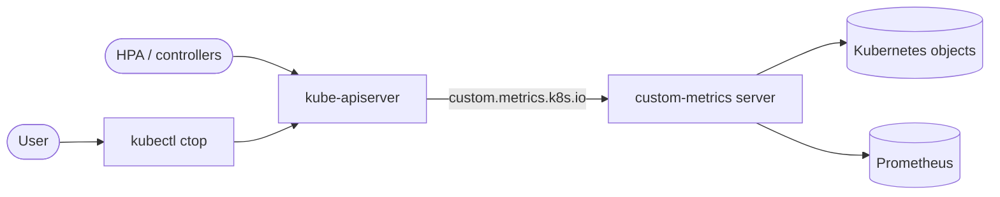
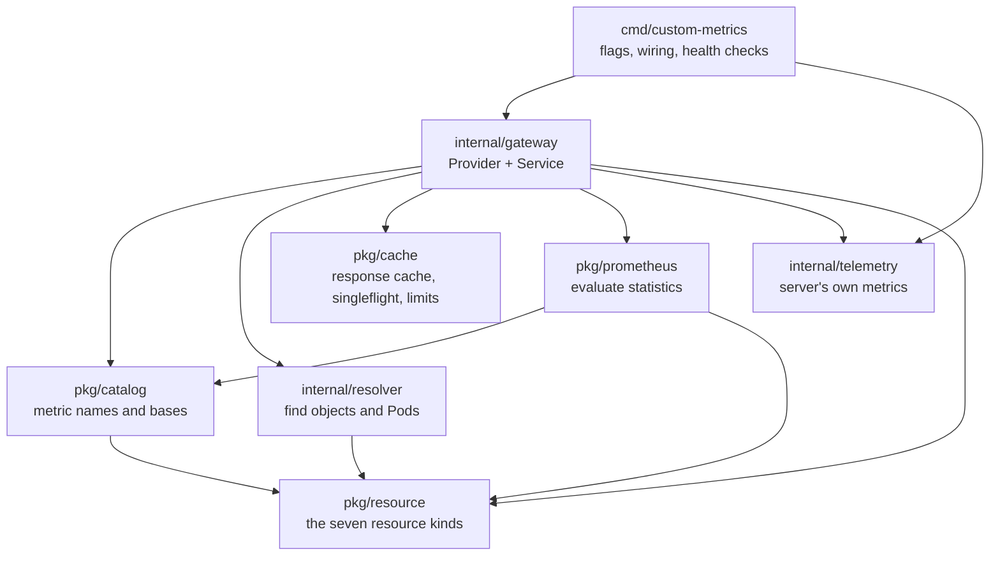
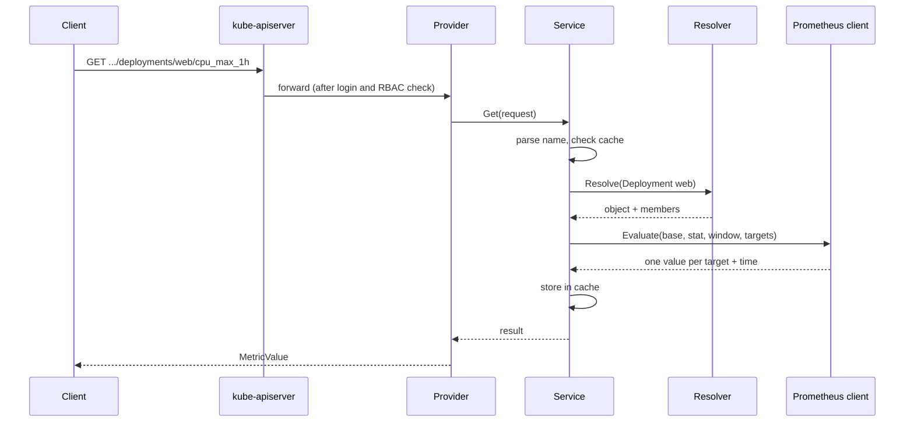

# Architecture

## What the project does

Kubernetes already shows current CPU and memory usage with `kubectl top`. But it only knows the latest value. It cannot answer questions like "What was the highest memory use of this Deployment in the last 24 hours?"

This project answers those questions. It reads historical usage from Prometheus and serves it through the standard Kubernetes API group `custom.metrics.k8s.io`. Because the data comes through a normal Kubernetes API, any tool can use it: `kubectl`, the Horizontal Pod Autoscaler (HPA), operators, or your own controllers.

## The two parts

The repository builds two separate programs:

| Program | Where it runs | What it does |
| :--- | :--- | :--- |
| `custom-metrics` | Inside the cluster | An API server. Kubernetes forwards `custom.metrics.k8s.io` requests to it. It asks Prometheus and returns the answer. |
| `kubectl-ctop` | On your computer | A kubectl plugin (`kubectl ctop`). It shows a table, similar to `kubectl top`, but with historical values. |

The plugin never talks to Prometheus or to the server's code directly. It only uses the normal Kubernetes API. So the plugin works with any server that offers the same metric names.



## Metric names

Every metric name has three parts:

```
<base>_<stat>_<window>
```

- **base**: what we measure. `cpu` and `memory` are for Pods and workloads. `node_cpu` and `node_memory` are for Nodes.
- **stat**: how we summarize the values over time. `avg`, `max`, `min`, `p50`, `p90`, `p95`, `p99`, or `stddev`.
- **window**: how far back we look. Any duration of one minute or more, for example `5m`, `1h`, `26m`, or `24h`.

Examples: `cpu_avg_5m`, `memory_max_1h`, `node_cpu_p95_12h`.

The server can answer every valid name. But it only *advertises* a small list in API discovery (the "discovery mode"). There are three modes: `full` lists many combinations, `minimal` (the default) lists one example per base, and `none` lists nothing. This keeps discovery cheap, because Kubernetes asks for it often.

## Supported resources

The server works with seven kinds of objects:

- Pods
- Nodes
- Deployments, StatefulSets, DaemonSets
- Jobs and CronJobs

For a workload (for example a Deployment), the server finds its Pods and combines their values into **one number** for the whole workload. For Nodes, a list request returns one row per Node.

CronJobs are special. The server looks for Jobs that are running now. If there are none, it looks for Jobs that ran recently (by default in the last day). If it still finds nothing, it returns "not found".

## Inside the server

The server code is split into small packages. Each one has one job.



| Package | Responsibility |
| :--- | :--- |
| `cmd/custom-metrics` | Reads flags and environment variables, loads the catalog, builds all parts, and starts the API server. It uses the upstream `custom-metrics-apiserver` library for the API server itself (TLS, authentication, authorization, discovery). |
| `internal/gateway` | The heart of the request flow. `Provider` connects to the upstream library. `Service` runs the steps of one request. It also turns every internal error into the right HTTP status. |
| `pkg/resource` | The one table of the seven resource kinds: each kind's API group, version and resource name, whether it is namespaced, and its scope (measured per Pod or per Node). Every other package, and `kubectl-ctop`, reads kinds from here. |
| `pkg/catalog` | Knows the four bases, their Prometheus series, units and rules. It parses metric names and builds the discovery list. |
| `internal/resolver` | Talks to Kubernetes. It turns "Deployment `web`" into the real object and its members: the names of its Pods, or a Node's own name. |
| `pkg/prometheus` | Talks to Prometheus. It takes a whole computation (base, stat, window, and the targets) and returns one value for each target. |
| `pkg/cache` | A memory cache for finished answers, a "singleflight" group that joins identical requests, and simple limits on how much work can run at once. |
| `internal/telemetry` | The server's own Prometheus metrics, such as cache hits and errors by reason. |

## How one request works

Here is what happens when someone asks for `cpu_max_1h` of Deployment `web`:



Step by step:

1. **Security.** Kubernetes checks who the caller is and asks if they may read this metric (a SubjectAccessReview). This happens before our code runs.
2. **Parse.** The service checks that the metric name is valid and that the base fits the resource. For example, `node_cpu` does not fit a Pod.
3. **Cache.** If a fresh answer is in the cache, the service returns it right away. Short windows (1 hour or less) stay in the cache for 15 seconds. Longer windows stay for 10 minutes.
4. **Join identical work.** If the same request is already running, the new caller waits for that result instead of starting new work.
5. **Resolve.** The resolver reads the object from Kubernetes and finds its Pods. It uses the server's own ServiceAccount.
6. **Evaluate.** The Prometheus client computes the value for every target in one go. It uses at most four Prometheus queries per computation, even for a list of many objects.
7. **Store and return.** The answer goes into the cache and back to the caller.

If something fails, the service turns the error into one clear HTTP status and counts it in the server's metrics with a short reason, for example `stale-data` or `admission-rejected`.

## How values are computed

### Input data

The server does not read raw exporter data by default. It expects a few clean "normalized" series, made by Prometheus recording rules. The rules live in `monitoring/rules.yaml` in this repository. They create:

- usage series: CPU cores and memory bytes per Pod and per Node;
- life-cycle series: was the Pod or Node active at this time?
- completeness series: did we get data from every container?

These rules run on a fixed 60-second grid.

### Quality checks

For normal (normalized) bases, every computation sends four queries:

1. **usage**: the statistic itself;
2. **any active**: was at least one Pod active in the window?
3. **coverage**: was any active Pod missing data?
4. **freshness**: is the newest data older than 30 seconds?

If nothing was active, the metric is "absent" (404 for one object, or the object is left out of a list). If data is missing or too old, the server returns an error (503) instead of a wrong number. The server never hides missing data.

When a list has many objects, the client puts all of them into the same four queries. Each object gets a small label so the answers can be split again afterwards.

### Combining Pods

A workload has many Pods. There are two ways to combine them:

- **sum-then-stat**: add all Pods together at each moment, then take the statistic. Good for CPU ("how many cores did the whole Deployment use at peak?").
- **stat-then-sum**: take the statistic for each Pod, then add the results. Good for memory requests ("how much memory does each Pod need at peak, in total?").

These two give different answers for `max` or `p95`. The catalog decides which one each base uses.

### Raw mode

Some clusters do not have the recording rules. For them, a base can use `raw` mode. It reads cAdvisor and node-exporter series directly. It sends only one query and does no quality checks, so the numbers can be wrong after scrape gaps.

### Evaluation time

All queries in one computation use the same time. This time is rounded down to the last full 60-second step, so all parts of the answer match.

## Limits and safety

The server protects itself and Prometheus:

- a limit on requests running at once (extra requests get 429 "Too Many Requests");
- a limit on separate computations running at once;
- a limit on Prometheus queries running at once in the whole process;
- a timeout per Prometheus query and a total timeout per computation;
- a maximum size for one query (1 MiB) and for one Prometheus response (16 MiB);
- a size limit for the response cache.

Other safety rules:

- TLS to Prometheus is always verified. An optional token file is read again for every request, so token rotation works without a restart.
- The ServiceAccount is only used to read objects. It is never used to decide who may see a metric.
- The server's own metrics never use namespace, object name, or user name as labels.

## The catalog

The catalog is a small YAML file, normally stored in a ConfigMap. It defines the four bases:

```yaml
bases:
  cpu:
    series: pod_cpu_usage_cores
    unit: cores
    scope: pod
    aggregation: sum-then-stat
```

The server reads and checks the catalog once, at start. If it is invalid, the server does not start. To change the catalog, you restart the server.

## The kubectl plugin

`kubectl ctop` has one sub-command per resource kind, for example `kubectl ctop pods` or `kubectl ctop deployments`. Flags choose the window (`--window`) and the statistic (`--stat`).

For each row it asks for two metrics, CPU and memory, through the standard custom-metrics client. Then it joins them into one table. It can also print JSON or YAML. Flags can also come from environment variables, but a flag on the command line always wins.

## Deployment

- A **Helm chart** in `charts/kubernetes-custom-metrics` installs the server: Deployment, Service, APIService, RBAC, ConfigMap for the catalog, certificates, PodDisruptionBudget, and an optional autoscaler.
- Plain YAML manifests are in `docs/deploy`.
- Container images and the plugin binary are built and released by GoReleaser. The plugin is also available through Homebrew.

The server has health checks. "Ready" means the catalog is loaded, the ServiceAccount can read objects, and Prometheus answers. "Alive" does not depend on Prometheus, so a Prometheus outage does not restart the server.

## Testing

- **Unit tests** cover each package. Packages talk to each other through small interfaces, so tests can use simple fakes (a fake resolver, a fake Prometheus HTTP server, a fake Kubernetes client).
- **Real Prometheus test.** If `prometheus` and `promtool` are installed, one test writes sample data into a real Prometheus and checks the computed values end to end.
- **Recording rule tests** use `promtool` to check the rules in `monitoring/`.

Run `make unit` for the tests and `make lint` for the linter.
