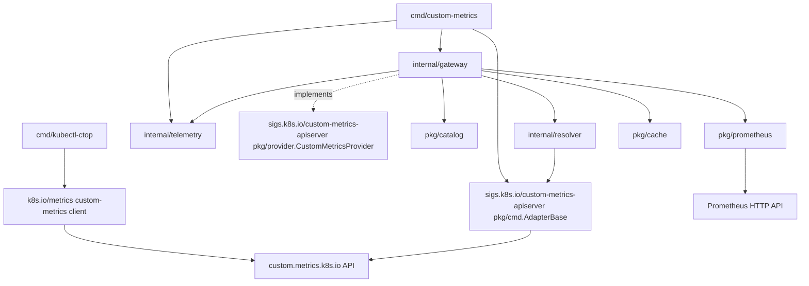

# Repository and Go Package Design

Status: proposed implementation layout for the revised v1 specification in [`metric-gateway.md`](metric-gateway.md). This is a design, not an implemented API guarantee.

## 1. Goals and constraints

The repository produces two independent binaries from one Go module:

- `cmd/kubectl-ctop`: the client-side kubectl plugin, installed as `kubectl-ctop` and invoked as `kubectl ctop`.
- `cmd/custom-metrics`: the in-cluster aggregated API server for `custom.metrics.k8s.io/v1beta2`.

Baseline choices:

- Go **1.26**.
- Kubernetes modules **v0.36.x**, kept at the same minor version (§14: pinned to match the latest `sigs.k8s.io/custom-metrics-apiserver` release).
- [`sigs.k8s.io/custom-metrics-apiserver`](https://github.com/kubernetes-sigs/custom-metrics-apiserver) provides the generic-apiserver wiring for `cmd/custom-metrics`: `pkg/cmd.AdapterBase` supplies secure serving, delegated authentication, delegated authorization, discovery, OpenAPI, health endpoints, a discovery-backed dynamic client/RESTMapper, and route installation for the `custom.metrics.k8s.io` group. This repository implements `pkg/provider.CustomMetricsProvider` and wires it into `AdapterBase`, the same pattern used by [`kubernetes-sigs/prometheus-adapter`](https://github.com/kubernetes-sigs/prometheus-adapter/blob/master/cmd/adapter/adapter.go). It does not reimplement generic-apiserver wiring, proxy authentication, or a public embeddable server facade — the upstream module already is that reusable facade, for this repository and for any other Go project that wants one.
- [`github.com/spf13/pflag`](https://github.com/spf13/pflag) for flags.
- [`github.com/spf13/cobra`](https://github.com/spf13/cobra) for command-line interface structure. Both `cmd/kubectl-ctop` and `cmd/custom-metrics` build their commands as `*cobra.Command` trees returned by constructor functions — never a package-level `var rootCmd = &cobra.Command{}` populated by `init()`, which would reintroduce process-global state. `cmd/custom-metrics` registers `AdapterBase`'s flags onto the same `*pflag.FlagSet` cobra owns (`cmd.Flags()`), rather than letting the framework default to `pflag.CommandLine`.
- The metric grammar, resource scope, aggregation behavior, cache TTLs, CronJob fallback, output shapes, and authorization model remain defined by `metric-gateway.md`. This document only defines how to organize their implementation.
- [`sigs.k8s.io/controller-tools/cmd/controller-gen`](https://github.com/kubernetes-sigs/controller-tools) generates the gateway `ClusterRole` from source markers.
- Business logic does not import command packages, write directly to global streams, or depend on process-global flag sets.
- Package boundaries follow responsibilities and test seams rather than creating a package for every type.

## 2. Proposed repository tree

```text
.
├── cmd/
│   ├── kubectl-ctop/
│   │   ├── main.go
│   │   ├── resources.go        # resource descriptor table and per-resource subcommand factory
│   │   ├── flags.go            # Options struct and env/default resolution
│   │   ├── version.go          # version information and build metadata
│   │   ├── client.go           # standard custom-metrics client and cancellation transport
│   │   ├── collector.go        # fetch CPU and memory rows
│   │   └── output.go           # table, flattened JSON, and YAML
│   └── custom-metrics/
│       ├── main.go
│       ├── command.go          # cobra root command; wires cobra flags into basecmd.AdapterBase
│       ├── flags.go            # gateway-specific Options struct, pflag definitions, validation
│       ├── version.go          # version information and build metadata
│       ├── health.go           # readiness/liveness checks injected into AdapterBase's config
│       └── rbac.go             # controller-gen RBAC markers only
├── internal/
│   ├── config/
│   │   ├── config.go            # configuration loading and validation
│   │   └── config_test.go
│   ├── resolver/
│   │   ├── resolver.go         # Resolver interface and resource dispatch
│   │   ├── kubernetes.go       # pod/node/workload selector resolution
│   │   ├── cronjob.go          # active/recent Job resolution
│   │   └── resolver_test.go
│   ├── gateway/
│   │   ├── provider.go         # implements provider.CustomMetricsProvider; API conversion
│   │   ├── service.go          # request orchestration independent of the provider interface
│   │   ├── types.go            # internal request/result types
│   │   └── service_test.go
│   └── telemetry/
│       └── metrics.go          # gateway Prometheus collectors, registered into k8s.io/component-base/metrics/legacyregistry
├── pkg/
│   ├── cache/
│   │   ├── cache.go            # size-bounded TTL LRU
│   │   ├── key.go              # canonical key and selector hashing
│   │   ├── admission.go        # counting admission limiter
│   │   ├── singleflight.go     # bounded shared-computation collapsing
│   │   └── *_test.go
│   ├── catalog/
│   │   ├── catalog.go          # catalog model, load, defaults, validation
│   │   ├── metric.go           # metric-name parse/build and supported values
│   │   └── catalog_test.go
│   └── prometheus/
│       ├── client.go           # bounded HTTP client and Prometheus API calls
│       ├── query.go            # normalized-series PromQL and coverage queries
│       ├── result.go           # vector/coverage decoding to internal samples
│       └── query_test.go
├── deploy/
│   ├── base/
│   │   └── role.yaml           # generated by controller-gen; do not edit
│   └── examples/
│       └── hpa.yaml
├── monitoring/
│   ├── rules.yaml              # normalized usage, lifecycle and completeness rules
│   └── rules_test.yaml         # promtool numerical fixtures
├── docs/
│   ├── metric-gateway.md
│   └── design.md
├── go.mod
├── go.sum
├── Makefile
└── README.md
```

Add directories only when their implementation begins. Generated files, release configuration, and CI can be added later; they are not required to start the core implementation.

### 2.1 Module boundary

There is one root `go.mod`. `pkg/` holds small, self-contained packages with no knowledge of this
repository's own domain (the catalog's YAML schema and PromQL rendering shape are generic
concerns, not gateway business logic) — currently `pkg/cache` (the size-bounded TTL LRU,
singleflight, and admission limiter), `pkg/prometheus` (structured-request-to-PromQL rendering and
the bounded query client), and `pkg/catalog` (the metric-catalog schema, validation, and discovery
expansion). `pkg/cache` and `pkg/prometheus` are fully dependency-free of this repository and of
`sigs.k8s.io/custom-metrics-apiserver`; `pkg/catalog` additionally imports that module's
data-only `pkg/provider` package for its `CustomMetricInfo` discovery type — see §3 rule 4's two
documented `AdapterBase` exceptions. None of the three has any reason not to be reusable by another
Go project on its own. `pkg/` is not a gateway facade, though: earlier drafts of this design
proposed a `pkg/custommetrics`
public package so external Go projects could embed a `custom.metrics.k8s.io` server built by this
repository. That package remains unnecessary: `sigs.k8s.io/custom-metrics-apiserver` is already the
reusable embedding point upstream, for every Go project including this one. A project that wants
its own `custom.metrics.k8s.io` server depends on that module directly, implements
`provider.CustomMetricsProvider` (and optionally `provider.ExternalMetricsProvider`), and wires it
into its own `basecmd.AdapterBase` — precisely the pattern `cmd/custom-metrics` follows for the
gateway's own logic. Publishing a second, repository-specific embeddable facade around the same
upstream package would just be a redundant wrapper with a narrower and less-maintained surface than
the upstream one.

`internal/` is therefore used only for this repository's own implementation-hiding, not to gate a public/private split motivated by reuse. A consumer that wants gateway behavior (Prometheus-backed aggregation, the catalog, CronJob fallback, the response cache) rather than a blank `provider.CustomMetricsProvider` would need to fork or vendor `internal/gateway` and its dependencies — that remains out of scope for a supported public API, the same conclusion the earlier design reached, just without inventing a package to hold it.

## 3. Dependency direction



Rules:

1. `cmd/custom-metrics` contains process setup, flags, RBAC markers, and the `AdapterBase` wiring: constructing the gateway's `internal/gateway` provider and registering it with `adapterBase.WithCustomMetrics(...)`. `cmd/kubectl-ctop` contains plugin-specific command and presentation code; neither command is imported by another package.
2. `internal/gateway/provider.go` implements `sigs.k8s.io/custom-metrics-apiserver/pkg/provider.CustomMetricsProvider` directly. There is no local provider-contract layer between it and the upstream interface, and no adapter package translating one provider contract into another.
3. `internal/gateway` owns the use-case flow: parse metric, check cache, resolve target with the ServiceAccount, validate coverage, query Prometheus, convert result, and store cache. It may use `sigs.k8s.io/custom-metrics-apiserver/pkg/provider/helpers` (`ResourceFor`, `ReferenceFor`, `ListObjectNames`) and `pkg/provider` error constructors (`NewMetricNotFoundError` and friends) rather than re-deriving `schema.GroupVersionResource` lookups or hand-building every `metav1.Status` object.
4. `pkg/catalog`, `internal/resolver`, `pkg/prometheus`, and `pkg/cache` do not import `sigs.k8s.io/custom-metrics-apiserver`'s `basecmd.AdapterBase` or any `cmd/custom-metrics` type, with two narrow, documented exceptions: `internal/resolver` may use `AdapterBase`'s dynamic client/RESTMapper accessors, passed in as plain `dynamic.Interface`/`meta.RESTMapper` values (§7); `pkg/catalog` imports the framework's data-only `pkg/provider` package for its `CustomMetricInfo` discovery type, since that is the type `provider.CustomMetricsProvider.ListAllMetrics` (§10) must return — a type dependency, not a dependency on the framework's serving/wiring machinery.
5. `cmd/kubectl-ctop` uses the standard `k8s.io/metrics/pkg/client/custom_metrics` client and must not call gateway internals. It communicates only through Kubernetes APIs. An external server must additionally expose the documented metric names and units; protocol conformance alone is not sufficient.
6. Kubernetes API objects stay near the server/client edges. Core orchestration uses small internal types, which keeps unit tests inexpensive.
7. Gateway-specific collectors and readiness checks are constructed by `cmd/custom-metrics` and injected into the `apiserver.Config` obtained from `adapterBase.Config()` before calling `adapterBase.Server()`/`adapterBase.Run(ctx)` (§10). `internal/gateway` does not import `AdapterBase` or reach into generic-apiserver internals; it only implements the provider interface and exposes plain Go readiness functions that `cmd/custom-metrics` wires in.

## 4. Binary entry points

Both `main.go` files should remain small and return meaningful exit codes.

```go
package main

import (
    "context"
    "os"
    "os/signal"
)

func main() {
    ctx, stop := signal.NotifyContext(context.Background(), os.Interrupt)
    code := run(ctx, os.Args[1:], os.Stdin, os.Stdout, os.Stderr)
    stop()
    os.Exit(code)
}
```

In the proposed flat `cmd/kubectl-ctop` layout, `main.go` directly calls the package-local `run` function, which builds the `*cobra.Command` tree with `NewRootCommand(...)`, wires the injected `io.Reader`/`io.Writer`s with `cmd.SetIn`/`SetOut`/`SetErr`, sets `cmd.SetArgs(args)`, and calls `cmd.ExecuteContext(ctx)`. `cmd/custom-metrics/main.go` follows the same pattern with its own single-command tree; its `RunE` ultimately calls `adapterBase.Run(ctx)`, which itself calls `GenericAPIServer.PrepareRun().RunWithContext(ctx)` — generic-apiserver's own graceful-shutdown path drains in-flight requests when `ctx` is canceled. The gateway must additionally handle `SIGTERM` for Kubernetes shutdown; platform-specific signal handling belongs in build-tagged files. Cleanup must occur before `os.Exit`, which does not run deferred functions.

Neither entry point uses `pflag.CommandLine` or a package-level `cobra.Command` populated by `init()`. Set `SilenceUsage` and `SilenceErrors` on every constructed command and print errors through the injected streams only. `run` maps the returned error to an exit code: a validation/usage error (flag parsing, `Args` rejection, `Options.Validate`) maps to `2`, any other error maps to `1`, matching the `ctop` exit-code contract in `metric-gateway.md` §7.3. `cobra.Command.Execute`/`ExecuteContext` never calls `os.Exit` itself, so performing this mapping in `run` before the single `os.Exit` call in `main` is safe.

## 5. Flag and environment design

### 5.1 Parsing

Each binary builds a `*cobra.Command` tree; cobra owns flag parsing through its embedded `*pflag.FlagSet` (`cmd.Flags()` for the single-command `cmd/custom-metrics` binary, `cmd.PersistentFlags()` for the flags shared by every `kubectl-ctop` resource subcommand). Cobra never calls `os.Exit`, so usage and parse errors surface as a returned `error` that `run` writes to the injected error stream (§4).

For `cmd/custom-metrics`, `command.go` constructs a `basecmd.AdapterBase`, sets `adapterBase.FlagSet = cmd.Flags()` before calling `adapterBase.InstallFlags()`, and separately registers the gateway-specific `Options` (§6.1 of `metric-gateway.md`: `--prometheus-url`, `--catalog-path`, `--cache-size`, `--cronjob-fallback-window`, and so on) onto the same `cmd.Flags()`. Both sets of flags parse together during `cmd.Execute()`; there is only one `*pflag.FlagSet` per process, owned by cobra.

```go
type Options struct {
    Window string
    Stat   string
    Output string
}

func (o *Options) AddFlags(fs *pflag.FlagSet) {
    fs.StringVar(&o.Window, "window", o.Window, "Statistical window")
    fs.StringVar(&o.Stat, "stat", o.Stat, "Statistic")
    fs.StringVarP(&o.Output, "output", "o", o.Output, "Output: table, json, yaml")
}
```

`AddFlags` only needs a `*pflag.FlagSet`, so it registers identically whether called with a bare `pflag.FlagSet` in a unit test or with `cmd.Flags()`/`cmd.PersistentFlags()` from a real `cobra.Command` — business logic and tests do not depend on cobra at all. Use one `Options` value per invocation, built by the command factory rather than stored in a package-level variable. `Complete` resolves kubeconfig/context-derived values, `Validate` rejects invalid combinations, and `Run` performs work:

```text
NewOptions(defaults) → AddFlags(cmd.Flags()) → cobra parses during Execute →
PersistentPreRunE: ResolveEnvironment(cmd.Flags().Changed, env) → Validate() →
RunE: Complete(ctx) → Run(ctx)
```

For `cmd/custom-metrics`, `Run(ctx)` constructs `internal/gateway`'s provider from the validated `Options`, calls `adapterBase.WithCustomMetrics(gatewayProvider)`, injects readiness checks (§10), and calls `adapterBase.Run(ctx)` last.

### 5.2 Precedence

Configuration precedence is:

```text
explicit CLI flag > environment variable > documented default
```

This precedence layer applies to the gateway-specific flags this repository defines (metric-gateway.md §6.1 and §6.2). `AdapterBase`'s own flags (secure serving, delegated authentication/authorization, discovery interval, client QPS/burst — §10) are plain `pflag` flags with no environment-variable binding; that is upstream's existing contract and this repository does not add one on top of it.

Bind documented defaults, parse flags, and then read/parse an environment value only when its corresponding flag was not explicitly set. A malformed overridden environment value must not defeat a valid CLI flag. Preserve changed-flag state across the root command's persistent flags and each resource subcommand's local flags — cobra merges a parent's `PersistentFlags` into every child command's effective `Flags()` before `Execute` parses arguments, so `cmd.Flags().Changed(name)` is reliable inside each subcommand's `PersistentPreRunE`/`RunE` — including explicit false/empty values. Keep environment access behind `LookupEnv func(string) (string, bool)` so tests do not mutate the process environment. Validate effective scalar values before Kubernetes I/O; `Complete` resolves client configuration and contextual namespace values.

Let client-go process the `KUBECONFIG` path list and file merging. Do not copy it into the single-file `ExplicitPath` field; use that field only for an explicit `--kubeconfig` flag.

Do not silently accept malformed durations, integers, booleans, statistics, windows, or output formats. Return an error naming the associated flag or environment variable.

### 5.3 ctop subcommands

`cmd/kubectl-ctop` is a `cobra.Command` tree: a root `ctop` command (registered with kubectl as `kubectl-ctop`, invoked as `kubectl ctop`) with one required subcommand per resource.

1. The root command registers the flags shared by every resource (`--window`, `--stat`, `--selector`/`-l`, `--namespace`/`-n`, `--no-headers`, `--sort-by`, `--output`/`-o`, `--request-timeout`, `--kubeconfig`, `--context`) on `PersistentFlags()`, so every subcommand inherits them without re-registering.
2. `resources.go` defines a small resource descriptor (canonical name, `Aliases`, and whether the resource is namespaced) for `pods`, `nodes`, `deployments`, `statefulsets`, `daemonsets`, `jobs`, and `cronjobs`. One `newResourceCommand(desc resourceDescriptor, deps) *cobra.Command` factory builds each subcommand from its descriptor. Cobra's `Use`/`Aliases`/`Short` fields replace a hand-rolled dispatch table, and cobra itself rejects an unknown or missing resource token.
3. No subcommand registers resource-specific flags beyond the inherited persistent set: `--containers` is deferred and stays an unknown flag for every resource in v1, so there is nothing for a per-resource `FlagSet` to add.
4. Each subcommand sets `Args: cobra.MaximumNArgs(1)` to allow at most one positional object name.
5. Each subcommand's shared `PreRunE` rejects `--namespace` when the descriptor marks the resource cluster-scoped (Nodes) and rejects `--selector` combined with a positional object name, driven by the descriptor rather than duplicated per command.

Aliases are declared directly on each `cobra.Command` (`po`, `deploy`, `sts`, `ds`, `job`, `cj`) via its `Aliases` field, while output and API requests use the descriptor's canonical resource name, never the alias the user typed.

## 6. Gateway request path

`internal/gateway/provider.go` implements `sigs.k8s.io/custom-metrics-apiserver/pkg/provider.CustomMetricsProvider`'s three methods (`GetMetricByName`, `GetMetricBySelector`, `ListAllMetrics`) and maps each provider call into the gateway request below. There is no separate adapter layer between the upstream interface and this repository's request type.

```go
type Request struct {
    Verb          string
    Namespace     string
    GroupResource schema.GroupResource
    Name          string
    Metric        string
    ObjectSelector labels.Selector
    MetricSelector labels.Selector
}
```

The main service is intentionally unaware of the provider interface and HTTP routing:

```go
type Resolver interface {
    Resolve(context.Context, Target) (Selection, error)
}

type Querier interface {
    Query(context.Context, Query) ([]Sample, error)
}

type ResponseCache interface {
    Get(Key) (Result, bool)
    Set(Key, Result, time.Duration)
}
```

Request execution order:

`AdapterBase`'s generic-apiserver filter chain performs delegated authentication (front-proxy headers or a direct bearer token, verified via `DelegatingAuthenticationOptions`) and then delegated authorization — a `SubjectAccessReview` issued by the gateway process against kube-apiserver for the exact verb/namespace/`custom.metrics.k8s.io` resource-and-subresource of the incoming request, via `DelegatingAuthorizationOptions` — before generic-apiserver ever dispatches to `internal/gateway`'s provider methods. The provider performs no additional per-caller authorization check; it uses its own ServiceAccount only to resolve backend objects (§7), never to decide who may ask.

1. Parse metric syntax and validate catalog membership/resource applicability. Validate both selectors; reject nonempty metric selectors and named-object selectors in v1.
2. Canonicalize both selectors and form the key with catalog revision, verb, namespace, group/resource, object name and metric name. Caller identity is intentionally excluded: the SubjectAccessReview above already gated this exact request tuple before the provider ran, and resolution always uses the same ServiceAccount, so the computed value does not vary by which authorized caller asked.
3. Return an unexpired immutable cached result, preserving object UIDs and evaluation timestamps.
4. On a miss, enter bounded `singleflight` with the same key and recheck the cache. Use a shared context bounded by server shutdown and the total deadline, not the first caller's context. Waiters cancel independently.
5. Resolve objects and retained Pod names using the gateway ServiceAccount. Enforce target/member limits while listing and deduplicate selector unions by name.
6. Capture one aligned evaluation time. Build normalized usage and lifecycle/completeness queries constrained by cluster and selected identities.
7. Check coverage, freshness, backend warnings and query budgets; evaluate the requested statistic only over valid active intervals.
8. Build an internal result carrying object identity, evaluation time, window and numeric values. Cache successful complete results (including valid empty wildcard lists), never errors. Enforce entry and byte limits and copy on read/write or enforce immutable ownership.
9. The gateway provider converts internal values into Kubernetes quantities and a `*custom_metrics.MetricValue`/`MetricValueList`, using `k8s.io/metrics/pkg/apis/custom_metrics/v1beta2` types and `pkg/provider` error constructors (`provider.NewMetricNotFoundError`, `NewMetricNotFoundForError`, `NewMetricNotFoundForSelectorError`) for the corresponding failure cases instead of hand-building `metav1.Status` objects. The installed REST storage in `sigs.k8s.io/custom-metrics-apiserver/pkg/registry/custom_metrics` wraps a named value in a one-item `MetricValueList` and serializes with negotiated codecs; both named and wildcard HTTP successes use lists.
10. Record bounded-cardinality telemetry; never use namespace, object name, selector or user as metric labels. Validate metric names before labeling telemetry.

`Result` and `Key` are internal value types; their definitions must preserve both selectors, object UID and original evaluation time. Account the retained in-memory size conservatively for byte eviction, not only the encoded response size.

Keep singleflight outside the LRU implementation: caching and duplicate suppression have different lifecycles and tests.

## 7. Resource resolution

`internal/resolver` receives typed targets and returns object identities plus deduplicated retained Pod/Node names (the identities the rendered PromQL matches on) and lifecycle metadata. It uses Kubernetes clients authenticated as the gateway ServiceAccount — the same identity `cmd/custom-metrics` gets from `adapterBase.ClientConfig()`/`DynamicClient()`/`RESTMapper()`, since `AdapterBase`'s `--lister-kubeconfig` (defaulting to in-cluster config) is exactly the gateway ServiceAccount's own credentials.

- Deployments, StatefulSets, DaemonSets, and Jobs may resolve their target object and its full `metav1.LabelSelector` (including `matchExpressions`, converted with `metav1.LabelSelectorAsSelector`) through `AdapterBase`'s dynamic client and RESTMapper rather than one hand-written typed client per kind: `provider/helpers.ResourceFor` maps a `provider.CustomMetricInfo` to its `schema.GroupVersionResource`, and `provider/helpers.ListObjectNames`/a plain `dynamic.Interface.Get` fetch the object(s) whose `.spec.selector` this package then converts and resolves against Pods. This collapses per-kind typed clients into one generic path; only Pod-selector-to-name resolution and the CronJob-specific ownership walk (below) remain bespoke.
- Pods and nodes resolve by API GET/list (typed `client-go` or the same dynamic client), retaining both UID and creation time (for `describedObject` and CronJob ownership matching) and name (for the identity the rendered PromQL matches on — a recreated object with the same name inherits its predecessor's Prometheus history, an accepted v1 tradeoff — metric-gateway.md §3.3).
- Wildcard requests list objects in the requested scope with the ServiceAccount and then produce one selection per object. Delegated authorization (§6) has already confirmed the caller may read this metric/resource tuple; Kubernetes list results here are not a caller-filtered inventory, they are the ServiceAccount's own view.
- CronJobs list Jobs in the namespace, confirm ownership by the CronJob UID (not name alone), prefer active Jobs, then use Jobs started or completed within the configured fallback duration. This ownership walk and the active-else-recent-else-404 branching are gateway business logic with no upstream equivalent; `provider/helpers` has no concept of CronJobs.
- Evaluate full workload/Job selectors through Kubernetes Pod lists, then union by Pod name. Do not translate arbitrary Kubernetes label keys into Prometheus matchers or merge incompatible selectors. Only escaped identity matchers reach PromQL.
- Absence of active/recent CronJob Jobs maps to the specified Kubernetes `NotFound` status (`provider.NewMetricNotFoundForError` or the selector variant); authorization, timeout, invalid metric, and backend errors remain distinct error classes.

Use a reusable ServiceAccount client and bounded paginated lists with request contexts. Never set `rest.Config.Impersonate`. Map gateway read-permission failures (the ServiceAccount itself lacking `get`/`list` on some resource) to service configuration errors (`503`), which is a distinct failure from the delegated `403` a caller gets when SAR denies their request before the provider runs.

The resolver implements retained-membership semantics, not historical ownership reconstruction. Preserve the active-Jobs-else-recent-Jobs rule explicitly; it can exclude completed runs when a new run becomes active. Missing retained metadata cannot be recovered from name-only historical series. Document Job/Pod retention prerequisites and test deletion/recreation with different UIDs.

## 8. Prometheus query layer

`pkg/prometheus/query.go` owns all PromQL rendering. Inputs are structured values, not pre-concatenated fragments. Label names are validated and label values are escaped before rendering.

The package should expose a narrow `Querier` interface and keep HTTP details private. Configure one reusable transport with verified TLS, optional token-file credentials, connection limits and timeout; propagate shared-computation contexts so shutdown/deadlines cancel backend requests. Reject credential-bearing redirects and URLs. Enforce global/per-computation concurrency, query length, decompressed body size and total deadlines from the specification; connection pooling alone does not bound workload.

Separate tests should use golden query strings for every combination of:

- normalized CPU rate gauges versus memory gauges (raw counter rates are tested in recording rules);
- pod/workload versus node;
- `sum-then-stat` versus `stat-then-sum`;
- each statistic, especially quantiles and standard deviation;
- single target, wildcard target, and deduplicated CronJob UID unions;
- empty sets, missing/duplicate series, overlapping selectors, source staleness and incomplete active-member coverage.

Prometheus responses must be checked for protocol errors, warnings/partial data, unexpected result types, duplicate identities, NaN/Inf, negative values and missing coverage before conversion. Require vector results for identity-bearing queries; a scalar is not silently assignable to an arbitrary resource. Validate lifecycle and completeness signals on the same grid as usage; a finite sum does not prove completeness. Do not use Prometheus lookback to bridge missing 60-second recording points silently.

`monitoring/` owns normalized recording rules and `promtool` fixtures for a documented scrape setup. The gateway consumes the fixed identity/unit/lifecycle contract in the spec, not raw exporter layouts. Numeric tests must distinguish fleet p95 from summed pod p95, check CPU mode exclusions and node used-memory conversion, and detect duplicate scrape sources and missing containers. Publishing this rule set is required before claiming historical correctness.

## 9. Catalog ownership

`pkg/catalog` owns:

- YAML decoding with unknown-field rejection;
- base-name validation;
- normalized series/unit/scope/aggregation validation;
- expansion into applicable resource/metric discovery entries according to `--discovery-mode` (`full`: every stat × canonical window; `minimal`, the default: one `<base>_avg_5m` example per resource; `none`), exposed as `[]provider.CustomMetricInfo` (the upstream type: `GroupResource`, `Namespaced`, `Metric`) for `ListAllMetrics` — this repository does not define its own metric-info type;
- metric parsing without relying on an ambiguous greedy regular expression;
- the discovery entry safety cap, applied to the advertised entries (784 for the full revised default catalog in `full` mode, 14 in `minimal`).

Because base names contain underscores (`node_cpu`), parse by matching a known catalog base prefix and then validating stat/window segments. Do not split the name into exactly three underscore-separated fields.

Load and validate the catalog before opening the serving socket. v1 does not require hot reload; changing the ConfigMap requires a rollout. Store the resulting catalog as immutable data shared by requests.

## 10. Kubernetes API server integration

`cmd/custom-metrics` embeds `basecmd "sigs.k8s.io/custom-metrics-apiserver/pkg/cmd"`'s `AdapterBase`, following the same shape as [`prometheus-adapter`'s `cmd/adapter/adapter.go`](https://github.com/kubernetes-sigs/prometheus-adapter/blob/master/cmd/adapter/adapter.go):

```go
type gatewayAdapter struct {
    basecmd.AdapterBase

    // gateway-specific Options: Prometheus connection, catalog path,
    // cache sizes, CronJob fallback window, cluster label, budgets.
    gatewayOptions gatewayflags.Options
}
```

`command.go` builds the `*cobra.Command`, sets `adapter.FlagSet = cmd.Flags()`, calls `adapter.InstallFlags()` for the framework's own flags, and calls `adapter.gatewayOptions.AddFlags(cmd.Flags())` for this repository's flags, all before `cmd.Execute()` parses. `RunE`:

1. Validates the gateway `Options` (§5.2).
2. Loads and validates the catalog (§9).
3. Constructs `internal/gateway`'s provider from the catalog, resolver, Prometheus client, and cache, using `adapter.ClientConfig()`/`adapter.DynamicClient()`/`adapter.RESTMapper()` for the resolver's Kubernetes access.
4. Calls `adapter.WithCustomMetrics(gatewayProvider)`.
5. Fetches `config, err := adapter.Config()` (an explicitly supported "advanced use case" hook per `AdapterBase`'s own documentation) and adds the gateway's readiness checks — catalog loaded, ServiceAccount reads working, a bounded Prometheus reachability check — via `config.GenericConfig.AddReadyzChecks(...)`. Liveness and discovery must not depend on Prometheus availability; only readiness may.
6. Registers `internal/telemetry`'s collectors into the same registry generic-apiserver's `/metrics` endpoint serves (`k8s.io/component-base/metrics/legacyregistry`), so there is one metrics stack, not two.
7. Calls `adapter.Run(ctx)`.

What this replaces from earlier drafts: there is no `internal/apiserver` package. `AdapterBase` already owns:

- `/apis/custom.metrics.k8s.io/v1beta2` route installation and discovery (from the `provider.CustomMetricInfo` entries `ListAllMetrics` returns);
- `/healthz`, `/readyz`, `/livez` (exact paths, anonymous, Prometheus-independent by default — the gateway only adds extra readyz checks, it does not reimplement these paths);
- `/metrics` for self-metrics, gated by the same delegated authentication/authorization as resource routes (see below — there is no separate bespoke monitoring-CA mechanism);
- serving certificate options and secure serving (`SecureServingOptionsWithLoopback`);
- delegated authentication (`DelegatingAuthenticationOptions`: front-proxy request-header identity from the `extension-apiserver-authentication` ConfigMap, with CA/name rotation, plus an optional direct bearer-token path via TokenReview) and delegated authorization (`DelegatingAuthorizationOptions`: a `SubjectAccessReview` per request against kube-apiserver, using the gateway's own ServiceAccount credentials to make that call — this is the standard aggregated-apiserver pattern also used by `metrics-server` and `prometheus-adapter`, not a bespoke proxy-only mode).

This is a deliberate reversal of an earlier draft's "no gateway SubjectAccessReview" decision: adopting `AdapterBase` as intended means adopting its delegated-authorization model, which checks the specific caller's RBAC against `custom.metrics.k8s.io` resources on every request — strictly more granular than trusting any caller who can reach the endpoint. See `metric-gateway.md` §5 for the full authorization model and the RBAC this requires of both the gateway ServiceAccount and metric-reading clients.

Because `/metrics` goes through the same delegated chain, a Prometheus `ServiceMonitor` (or any scraper) needs a bearer token bound to a ClusterRole granting `get` on the nonResourceURL `/metrics` — the same pattern used to scrape kube-apiserver or kubelet — rather than a second monitoring-specific client CA and CN allowlist.

Reload serving certificates and drain on SIGTERM remain requirements; `AdapterBase`/generic-apiserver handle certificate rotation and graceful shutdown once configured, so this repository does not hand-roll that logic. Test the wiring (readiness checks fire correctly, discovery reflects the catalog, SAR-denied callers get `403`, SAR-allowed callers reach the provider) rather than re-testing generic-apiserver's own authentication/authorization mechanics.

## 11. Consuming custom metrics

External clients and `kubectl-ctop` use `k8s.io/metrics/pkg/client/custom_metrics` directly. It supports `rest.Config`, REST mapping, namespaced/root-scoped resources and both selector channels. In v0.37.0, the client exposes **v1beta2 Go result types**, converting v1beta2 wire responses as needed; serving only v1beta2 is compatible. Do not duplicate the upstream client or assume its in-memory types match the served wire version.

Example:

```go
// availableAPIs implements custom_metrics.AvailableAPIsGetter using discovery.
client := custom_metrics.NewForConfig(restConfig, mapper, availableAPIs)

value, err := client.NamespacedMetrics("prod").GetForObject(
    schema.GroupKind{Group: "apps", Kind: "Deployment"},
    "web",
    "cpu_p95_1h",
    labels.Everything(),
)
```

The constructor returns one client, not `(client, error)`; its third argument is an `AvailableAPIsGetter`, not a dynamic client. Construction may be lazy; handle errors on discovery and metric calls.

The v0.37.0 metric methods accept no context and internally use `context.TODO()`. For `ctop`, bound every HTTP call with `rest.Config.Timeout` and a private transport wrapper that combines the HTTP request context with the invocation context. Apply it to discovery and metric transports; clean up cancellation callbacks after each round trip. Do not mutate shared clients or use a goroutine that leaves unbounded calls running after cancellation. Test cancellation of a stalled HTTP server and subsequent terminal restoration. This local lifecycle adapter is not a competing public metrics client.

There is no reciprocal "embedding a custom-metrics API server" case for this repository to support (§2.1): that role belongs to `sigs.k8s.io/custom-metrics-apiserver` upstream, and this repository is simply one of its consumers.

## 12. ctop client flow

`cmd/kubectl-ctop` uses Kubernetes client configuration loading rules from `client-go`, with explicit `--kubeconfig` and `--context` overrides. It queries `cpu`/`memory` for namespaced resources and `node_cpu`/`node_memory` for Nodes. It preserves returned timestamps, windows and UIDs in an internal fetched-value model, joins by resource/namespace/name/UID, and only then emits the flat row model:

```go
type Row struct {
    Namespace string `json:"namespace,omitempty" yaml:"namespace,omitempty"`
    Name      string `json:"name" yaml:"name"`
    CPU       string `json:"cpu" yaml:"cpu"`
    Memory    string `json:"memory" yaml:"memory"`
}
```

Keep fetching, joining, sorting, and rendering separate:

- `client.go` returns metric values without formatting.
- `collector.go` rejects mismatched sets/incarnations without emitting partial output; both empty lists produce an empty array. It retains evaluation timestamps and reports age/skew on stderr. The API does not offer an atomic CPU/memory snapshot.
- `output.go` sorts quantities numerically, formats them, and produces stable table/JSON/YAML output. Machine output preserves the flat shape, so metadata diagnostics stay off stdout.

`ctop` is a one-shot snapshot tool: it fetches once, joins, and renders — no watch/refresh mode. `--containers` is deferred because the wire and row contracts expose only pod aggregates.

`cmd/kubectl-ctop` is entirely unaffected by §10's framework adoption: it only ever speaks the `custom.metrics.k8s.io` wire protocol as a client, never the server side.

## 13. RBAC generation with controller-gen

The gateway's `ClusterRole` is generated from `+kubebuilder:rbac` markers in `cmd/custom-metrics/rbac.go`. Keep the markers close to the binary that needs the permissions, while keeping the file free of runtime behavior.

```go
package main

// +kubebuilder:rbac:groups="",resources=pods;nodes,verbs=get;list
// +kubebuilder:rbac:groups=apps,resources=deployments;statefulsets;daemonsets,verbs=get;list
// +kubebuilder:rbac:groups=batch,resources=jobs;cronjobs,verbs=get;list
```

No impersonation permission is needed, but delegated authentication/authorization does require two things generated markers cannot express, so they are maintained (not generated) manifests instead:

- A `ClusterRoleBinding` of the gateway ServiceAccount to the built-in `system:auth-delegator` `ClusterRole`, which grants `create` on `tokenreviews.authentication.k8s.io` and `subjectaccessreviews.authorization.k8s.io` — required for `DelegatingAuthenticationOptions`/`DelegatingAuthorizationOptions` to call kube-apiserver on the gateway's behalf.
- A `RoleBinding` in `kube-system` to `extension-apiserver-authentication-reader`, scoped to the gateway ServiceAccount, so it can read the `extension-apiserver-authentication` ConfigMap for request-header CA/name and client-CA configuration.

Avoid wildcard resources and verbs on the generated `ClusterRole`. Example user/HPA roles grant custom-metrics resource/metric subresource reads, not underlying workload reads — and, under the delegated-authorization model, those are the RBAC bindings kube-apiserver actually enforces per caller via SAR, not merely documentation of intent.

Pin `controller-gen` as a Go tool dependency rather than relying on a developer's globally installed version. With the Go tool directive, the intended workflow is:

```text
go get -tool sigs.k8s.io/controller-tools/cmd/controller-gen@<pinned-version>
go tool controller-gen rbac:roleName=custom-metrics paths=./cmd/custom-metrics output:rbac:artifacts:config=deploy/base
```

`deploy/base/role.yaml` is generated and committed. It must carry a generated-file header and must not be edited manually. `make generate` reruns all generators.

Only the permission-bearing `ClusterRole` is generated. ServiceAccount, the `system:auth-delegator` and `extension-apiserver-authentication-reader` bindings, aggregated-metrics-reader bindings, and `APIService` remain maintained deployment manifests because controller-gen RBAC markers do not describe those objects.

Deployment validation must check serving-CA injection/rotation, optional cert-manager/ServiceMonitor CRDs, control-plane reachability, and collisions with an existing APIService for the same group/version. Never overwrite another metrics adapter silently.

## 14. Dependency policy

The initial `go.mod` should use the repository module path and declare Go 1.27. Expected direct dependencies include:

```text
github.com/spf13/pflag
github.com/spf13/cobra                  # command trees for both binaries
sigs.k8s.io/custom-metrics-apiserver    v1.36.0
k8s.io/api                              v0.36.x
k8s.io/apimachinery                     v0.36.x
k8s.io/apiserver                        v0.36.x
k8s.io/client-go                        v0.36.x
k8s.io/metrics                          v0.36.x
k8s.io/component-base                   # legacyregistry for self-metrics
golang.org/x/sync                       # singleflight
sigs.k8s.io/yaml                        # user-facing YAML where appropriate
sigs.k8s.io/controller-tools            # pinned controller-gen tool dependency
```

Select an `sigs.k8s.io/custom-metrics-apiserver` version whose `go.mod` resolves to the same `k8s.io/*` minor this repository pins; that module tracks Kubernetes minors closely and does not offer broad cross-minor compatibility, so its version is part of the same alignment check as the rest of the `k8s.io/*` set. As of this writing, `v1.36.0` is the latest published tag and pins `k8s.io/*` `v0.36.1`; there is no `v1.37.0` yet. Forcing `k8s.io/api`/`apimachinery`/`apiserver` to `v0.37.0` while keeping `custom-metrics-apiserver` at `v1.36.0` fails to build (its generated OpenAPI definitions reference `v1.PodStatusResult`, removed from `k8s.io/api` in `v0.37.0`), so the whole `k8s.io/*` set is pinned to `v0.36.1` instead. Revisit this pin (and this table) once a `custom-metrics-apiserver` release tracks a newer Kubernetes minor.

An LRU implementation may use a maintained size-bounded library or a small repository-local implementation; choose only after checking TTL and concurrency semantics.

Policies:

- Keep Kubernetes module minors — including `sigs.k8s.io/custom-metrics-apiserver`'s — aligned and automate this check in CI.
- Commit `go.sum` and use `go mod tidy` in validation.
- Avoid importing `k8s.io/kubernetes`; consume staged modules only.
- Prefer standard-library packages unless a dependency materially reduces protocol or terminal complexity.
- Record the actual minimum selected dependency versions in `go.mod`; "or newer" is a compatibility target, not an unbounded build rule.

## 15. Testing layout

Tests live beside their packages. Add `testdata/` only for golden PromQL, catalog fixtures, API responses, and terminal snapshots.

Test levels:

1. **Unit:** parser/applicability, both selectors, catalog validation, entry/byte cache eviction, shared-context cancellation, CronJob retained membership, UID-based joining and environment precedence.
2. **Component:** provider plus fake resolver/Prometheus/cache; resolver plus Kubernetes fake client; Prometheus client plus `httptest.Server`.
3. **API integration:** a real `AdapterBase`-built server against a temporary kube-apiserver/envtest (or `sigs.k8s.io/custom-metrics-apiserver`'s own test scaffolding) with fake `SubjectAccessReview`/`TokenReview` responses: discovery, named list envelopes, wildcard omissions, error codes, a caller with the right custom-metrics RBAC succeeding, a caller without it getting `403` from delegated authorization, CA/CN rotation for the request-header config, health, monitoring route isolation and stalled-request cancellation. This layer tests the *wiring* — that this repository configured `AdapterBase` correctly — not generic-apiserver's own authentication/authorization mechanics, which are upstream's tested responsibility.
4. **Prometheus numerical:** `promtool` rule fixtures plus a real Prometheus query fixture for both aggregation orders, coverage gaps, lifecycle, source deduplication, CPU mode exclusions, node memory and quantity boundaries. Golden strings alone cannot prove statistical correctness.
5. **End-to-end (release gate):** Kind cluster with an aggregated `APIService`; a user authorized (via real RBAC on `custom.metrics.k8s.io`) for metric reads but forbidden underlying workload reads succeeds on cold/hot cache and shared-flight paths, while a user without that custom-metrics RBAC is rejected by delegated authorization before reaching `internal/gateway`. Verify HPA and `ctop` with v1beta2 discovery and normalized fixtures.

Use an injected clock for TTL and CronJob fallback tests; never make tests sleep. Run race tests for cache, singleflight and dynamic certificate reloads.

## 16. Build and release targets

A small `Makefile` can provide stable developer entry points:

```text
make build       # build both binaries into bin/
make test        # go test -race ./...
make vet         # go vet ./...
make generate    # run pinned controller-gen and other generators
make manifests   # validate deployment YAML and RBAC policy
make test-rules  # pinned promtool, normalized recording-rule fixtures
```

Release jobs cross-compile only `kubectl-ctop` to the raw artifact names specified by the v1 design. The in-cluster `custom-metrics` binary is distributed in a container image, with a non-root user, read-only root filesystem, and no shell required.

## 17. Suggested implementation order

1. Initialize `go.mod`, pin `sigs.k8s.io/custom-metrics-apiserver`, `controller-gen`, and Prometheus test tooling, and add both minimal entry points with their `cobra.Command` root construction (a single command for `custom-metrics`, wrapping `basecmd.AdapterBase`; a root plus seven resource subcommands for `kubectl-ctop`).
2. Prove the `AdapterBase` wiring end-to-end with a fake `provider.CustomMetricsProvider`: discovery lists its `CustomMetricInfo` entries, a client using `k8s.io/metrics/pkg/client/custom_metrics` gets correct named/wildcard responses, a SAR-denied caller gets `403`, a SAR-allowed caller reaches the fake provider. No gateway-specific logic yet.
3. Implement normalized recording rules and numerical coverage/identity fixtures alongside immutable catalog loading and metric parsing.
4. Implement ServiceAccount resource resolution (using `AdapterBase`'s dynamic client/RESTMapper where it fits, §7) and retained-membership CronJob fallback, then structured PromQL and validated result conversion.
5. Implement entry/byte-bounded cache, bounded singleflight, admission/query budgets and gateway orchestration.
6. Wire the real `internal/gateway` provider into `AdapterBase` in place of step 2's fake, add injected telemetry/readiness; verify endpoint-level SAR authorization with real aggregation.
7. Implement the `ctop` fetch/join/output path behind the resource subcommand tree.
8. Add controller-gen RBAC markers, generated RBAC, the `system:auth-delegator`/`extension-apiserver-authentication-reader` bindings and remaining deployment manifests, and API integration tests.

This sequence validates security and wire contracts early, then establishes numerical correctness before adding terminal presentation. Documentation of a rule contract is not a substitute for a tested deployable normalization pipeline.
