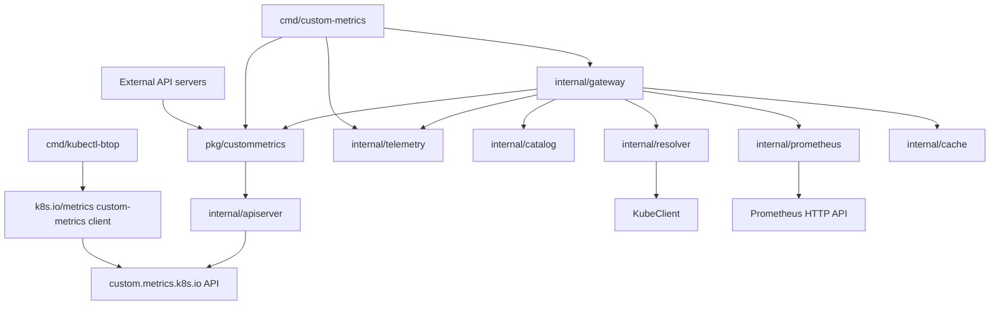

# Repository and Go Package Design

Status: proposed implementation layout for the revised v1 specification in [`metric-gateway.md`](metric-gateway.md). This is a design, not an implemented API guarantee.

## 1. Goals and constraints

The repository produces two independent binaries from one Go module:

- `cmd/kubectl-btop`: the client-side kubectl plugin, installed as `kubectl-btop` and invoked as `kubectl btop`.
- `cmd/custom-metrics`: the in-cluster aggregated API server for `custom.metrics.k8s.io/v1beta2`.

Baseline choices:

- Go **1.26**.
- Kubernetes modules **v0.36.x or newer**, kept at the same minor version.
- [`github.com/spf13/pflag`](https://github.com/spf13/pflag) for flags.
- [`github.com/spf13/cobra`](https://github.com/spf13/cobra) for command-line interface structure. Both `cmd/kubectl-btop` and `cmd/custom-metrics` build their commands as `*cobra.Command` trees returned by constructor functions — never a package-level `var rootCmd = &cobra.Command{}` populated by `init()`, which would reintroduce process-global state.
- The supported external API is placed under `pkg/custommetrics`; all gateway-specific and implementation-only packages are placed under `internal/`.
- `pkg/custommetrics` is the supported public API for external Go projects that embed a `custom.metrics.k8s.io` server. API consumers use Kubernetes' standard custom-metrics client directly.
- [`sigs.k8s.io/controller-tools/cmd/controller-gen`](https://github.com/kubernetes-sigs/controller-tools) generates the gateway `ClusterRole` from source markers.
- Business logic does not import command packages, write directly to global streams, or depend on process-global flag sets.
- Package boundaries follow responsibilities and test seams rather than creating a package for every type.

The metric grammar, resource scope, aggregation behavior, cache TTLs, CronJob fallback, output shapes, and authorization policy remain defined by `metric-gateway.md`. This document only defines how to organize their implementation.

## 2. Proposed repository tree

```text
.
├── cmd/
│   ├── kubectl-btop/
│   │   ├── main.go
│   │   ├── command.go          # cobra root command, persistent flags, env resolution
│   │   ├── resources.go        # resource descriptor table and per-resource subcommand factory
│   │   ├── flags.go            # Options struct and env/default resolution
│   │   ├── version.go          # version information and build metadata
│   │   ├── client.go           # standard custom-metrics client and cancellation transport
│   │   ├── collector.go        # fetch CPU and memory rows
│   │   ├── output.go           # table, flattened JSON, and YAML
│   │   └── watch.go            # refresh loop and TTY/non-TTY behavior
│   └── custom-metrics/
│       ├── main.go
│       ├── command.go          # cobra root command, env resolution, RunE lifecycle
│       ├── flags.go            # Options struct, pflag definitions, validation
│       ├── version.go          # version information and build metadata
│       └── rbac.go             # controller-gen RBAC markers only
├── pkg/
│   ├── custommetrics/
│   │   ├── provider.go         # stable provider contract for external projects
│   │   ├── server.go           # embeddable API server facade
│   │   ├── options.go          # server configuration without CLI concerns
│   │   ├── doc.go              # package contract and examples
│   │   └── server_test.go
│   │
│   │
├── internal/
│   ├── custom-provider/
│   │   ├── app.go              # generic server lifecycle, no gateway wiring
│   │   ├── apiserver.go        # API group installation and HTTP plumbing
│   │   ├── provider.go         # structural provider contract and storage adapter
│   │   ├── discovery.go        # APIResource discovery from provider descriptors
│   │   ├── authentication.go   # proxy-only and monitoring route authentication
│   │   └── provider_test.go
│   ├── config/
│   │   ├── config.go            # configuration loading and validation
│   │   └── config_test.go
│   │
│   ├── catalog/
│   │   ├── catalog.go          # catalog model, load, defaults, validation
│   │   ├── metric.go           # metric-name parse/build and supported values
│   │   └── catalog_test.go
│   ├── resolver/
│   │   ├── resolver.go         # Resolver interface and resource dispatch
│   │   ├── kubernetes.go       # pod/node/workload selector resolution
│   │   ├── cronjob.go          # active/recent Job resolution
│   │   └── resolver_test.go
│   ├── prometheus/
│   │   ├── client.go           # bounded HTTP client and Prometheus API calls
│   │   ├── query.go            # normalized-series PromQL and coverage queries
│   │   ├── result.go           # vector/coverage decoding to internal samples
│   │   └── query_test.go
│   ├── gateway/
│   │   ├── provider.go         # public Provider implementation; API conversion
│   │   ├── service.go          # request orchestration independent of HTTP
│   │   ├── types.go            # internal request/result types
│   │   └── service_test.go
│   ├── cache/
│   │   ├── cache.go            # size-bounded TTL LRU
│   │   ├── key.go              # canonical key and selector hashing
│   │   └── cache_test.go
│   └── telemetry/
│       └── metrics.go          # gateway Prometheus collectors
├── deploy/
│   ├── base/
│   │   └── role.yaml           # generated by controller-gen; do not edit
│   └── examples/
│       └── hpa.yaml
├── monitoring/
│   ├── rules.yaml              # normalized usage, lifecycle and completeness rules
│   └── rules_test.yaml         # promtool numerical fixtures
├── docs/
│   ├── metric-gateway.md
│   └── design.md
├── go.mod
├── go.sum
├── Makefile
└── README.md
```

Add directories only when their implementation begins. Generated files, release configuration, and CI can be added later; they are not required to start the core implementation.

### 2.1 Module boundary

The initial repository uses one root `go.mod`; `pkg/custommetrics` does not have a nested module. Go's `internal` rule allows `pkg/custommetrics` to delegate to packages beneath this repository's `internal/` directory while preventing external projects from importing those implementation packages directly.

A consumer that imports `pkg/custommetrics` compiles only its transitive dependency graph; unrelated gateway packages such as `internal/prometheus`, `internal/resolver`, and `internal/cache` are not dependencies unless the public package imports them. Keep `pkg/custommetrics` dependent only on `internal/apiserver` and the required Kubernetes API machinery.

Consider a separate module later only when independent release versioning or measured dependency/build-size problems justify the additional multi-module release and testing complexity.

## 3. Dependency direction



Rules:

1. `cmd/custom-metrics` contains process setup, flags, and RBAC markers. `cmd/kubectl-btop` contains plugin-specific command and presentation code; neither command is imported by another package.
2. `pkg/custommetrics` is the only supported public package. It exposes the provider contract and lifecycle facade, delegating implementation to `internal/apiserver`.
3. `internal/apiserver` adapts Kubernetes API machinery requests to a provider; it does not build PromQL or import gateway implementation packages.
4. `internal/gateway` owns the use-case flow: parse metric, check cache, resolve target with the ServiceAccount, validate coverage, query Prometheus, convert result, and store cache. Its provider implements the public contract; it can import `pkg/custommetrics` without a cycle because the public package never imports the gateway.
5. `internal/catalog`, `internal/resolver`, `internal/prometheus`, and `internal/cache` do not import `internal/apiserver`.
6. `cmd/kubectl-btop` uses the standard `k8s.io/metrics/pkg/client/custom_metrics` client and must not call gateway internals. It communicates only through Kubernetes APIs. An external server must additionally expose the documented metric names and units; protocol conformance alone is not sufficient.
7. Kubernetes API objects stay near the server/client edges. Core orchestration uses small internal types, which keeps unit tests inexpensive.
8. External server implementations import only `pkg/custommetrics`. Every type in the public contract must have a supported public or upstream name. Documented public aliases may hide internal representations, but callers must never need an `internal/*` import. Alias representations are part of the public compatibility promise.
9. The dependency direction is one-way: `pkg/custommetrics` may delegate to `internal/apiserver`, but `internal/apiserver` must not import `pkg/custommetrics`. Matching internal interfaces structurally prevents an import cycle.
10. `pkg/custommetrics` must not import `internal/gateway`, `internal/prometheus`, `internal/resolver`, `internal/catalog`, `internal/cache`, or command packages. This keeps its external dependency graph limited to the embeddable API-server functionality.
11. Gateway-specific collectors and readiness checks are constructed by `cmd/custom-metrics` and injected via the public options. `internal/apiserver` must not import gateway telemetry indirectly or load the catalog.

## 4. Binary entry points

Both `main.go` files should remain small and return meaningful exit codes.

```go
package main

import (
    "context"
    "os"
    "os/signal"
)

func main() {
    ctx, stop := signal.NotifyContext(context.Background(), os.Interrupt)
    code := run(ctx, os.Args[1:], os.Stdin, os.Stdout, os.Stderr)
    stop()
    os.Exit(code)
}
```

In the proposed flat `cmd/kubectl-btop` layout, `main.go` directly calls the package-local `run` function, which builds the `*cobra.Command` tree with `NewRootCommand(...)`, wires the injected `io.Reader`/`io.Writer`s with `cmd.SetIn`/`SetOut`/`SetErr`, sets `cmd.SetArgs(args)`, and calls `cmd.ExecuteContext(ctx)`. `cmd/custom-metrics/main.go` follows the same pattern with its own single-command tree. The gateway must additionally handle `SIGTERM` for Kubernetes shutdown; platform-specific signals and terminal resizing belong in build-tagged files. Drain in-flight work before returning, within the termination grace period. Cleanup must occur before `os.Exit`, which does not run deferred functions.

Neither entry point uses `pflag.CommandLine` or a package-level `cobra.Command` populated by `init()`. Set `SilenceUsage` and `SilenceErrors` on every constructed command and print errors through the injected streams only. `run` maps the returned error to an exit code: a validation/usage error (flag parsing, `Args` rejection, `Options.Validate`) maps to `2`, any other error maps to `1`, matching the `btop` exit-code contract in `metric-gateway.md` §7.3. `cobra.Command.Execute`/`ExecuteContext` never calls `os.Exit` itself, so performing this mapping in `run` before the single `os.Exit` call in `main` is safe.

## 5. Flag and environment design

### 5.1 Parsing

Each binary builds a `*cobra.Command` tree; cobra owns flag parsing through its embedded `*pflag.FlagSet` (`cmd.Flags()` for the single-command `cmd/custom-metrics` binary, `cmd.PersistentFlags()` for the flags shared by every `kubectl-btop` resource subcommand). Cobra never calls `os.Exit`, so usage and parse errors surface as a returned `error` that `run` writes to the injected error stream (§4).

```go
type Options struct {
    Window string
    Stat   string
    Output string
}

func (o *Options) AddFlags(fs *pflag.FlagSet) {
    fs.StringVar(&o.Window, "window", o.Window, "Statistical window")
    fs.StringVar(&o.Stat, "stat", o.Stat, "Statistic")
    fs.StringVarP(&o.Output, "output", "o", o.Output, "Output: table, json, yaml")
}
```

`AddFlags` only needs a `*pflag.FlagSet`, so it registers identically whether called with a bare `pflag.FlagSet` in a unit test or with `cmd.Flags()`/`cmd.PersistentFlags()` from a real `cobra.Command` — business logic and tests do not depend on cobra at all. Use one `Options` value per invocation, built by the command factory rather than stored in a package-level variable. `Complete` resolves kubeconfig/context-derived values, `Validate` rejects invalid combinations, and `Run` performs work:

```text
NewOptions(defaults) → AddFlags(cmd.Flags()) → cobra parses during Execute →
PersistentPreRunE: ResolveEnvironment(cmd.Flags().Changed, env) → Validate() →
RunE: Complete(ctx) → Run(ctx)
```

### 5.2 Precedence

Configuration precedence is:

```text
explicit CLI flag > environment variable > documented default
```

Bind documented defaults, parse flags, and then read/parse an environment value only when its corresponding flag was not explicitly set. A malformed overridden environment value must not defeat a valid CLI flag. Preserve changed-flag state across the root command's persistent flags and each resource subcommand's local flags — cobra merges a parent's `PersistentFlags` into every child command's effective `Flags()` before `Execute` parses arguments, so `cmd.Flags().Changed(name)` is reliable inside each subcommand's `PersistentPreRunE`/`RunE` — including explicit false/empty values. Keep environment access behind `LookupEnv func(string) (string, bool)` so tests do not mutate the process environment. Validate effective scalar values before Kubernetes I/O; `Complete` resolves client configuration and contextual namespace values.

Let client-go process the `KUBECONFIG` path list and file merging. Do not copy it into the single-file `ExplicitPath` field; use that field only for an explicit `--kubeconfig` flag.

Do not silently accept malformed durations, integers, booleans, statistics, windows, or output formats. Return an error naming the associated flag or environment variable.

### 5.3 btop subcommands

`cmd/kubectl-btop` is a `cobra.Command` tree: a root `btop` command (registered with kubectl as `kubectl-btop`, invoked as `kubectl btop`) with one required subcommand per resource.

1. The root command registers the flags shared by every resource (`--window`, `--stat`, `--selector`/`-l`, `--namespace`/`-n`, `--no-headers`, `--sort-by`, `--output`/`-o`, `--watch`/`-w`, `--watch-interval`, `--request-timeout`, `--kubeconfig`, `--context`) on `PersistentFlags()`, so every subcommand inherits them without re-registering.
2. `resources.go` defines a small resource descriptor (canonical name, `Aliases`, and whether the resource is namespaced) for `pods`, `nodes`, `deployments`, `statefulsets`, `daemonsets`, `jobs`, and `cronjobs`. One `newResourceCommand(desc resourceDescriptor, deps) *cobra.Command` factory builds each subcommand from its descriptor. Cobra's `Use`/`Aliases`/`Short` fields replace a hand-rolled dispatch table, and cobra itself rejects an unknown or missing resource token.
3. No subcommand registers resource-specific flags beyond the inherited persistent set: `--containers` is deferred and stays an unknown flag for every resource in v1, so there is nothing for a per-resource `FlagSet` to add.
4. Each subcommand sets `Args: cobra.MaximumNArgs(1)` to allow at most one positional object name.
5. Each subcommand's shared `PreRunE` rejects `--namespace` when the descriptor marks the resource cluster-scoped (Nodes) and rejects `--selector` combined with a positional object name, driven by the descriptor rather than duplicated per command.

Aliases are declared directly on each `cobra.Command` (`po`, `deploy`, `sts`, `ds`, `job`, `cj`) via its `Aliases` field, while output and API requests use the descriptor's canonical resource name, never the alias the user typed.

## 6. Gateway request path

`internal/gateway/provider.go` implements `pkg/custommetrics.Provider` and maps provider calls into the gateway request. `internal/apiserver/provider.go` only adapts generic API machinery to the injected provider; it knows no gateway request types.

```go
type Request struct {
    Verb          string
    Namespace     string
    GroupResource schema.GroupResource
    Name          string
    Metric        string
    ObjectSelector labels.Selector
    MetricSelector labels.Selector
}
```

The main service is intentionally unaware of HTTP routing:

```go
type Resolver interface {
    Resolve(context.Context, Target) (Selection, error)
}

type Querier interface {
    Query(context.Context, Query) ([]Sample, error)
}

type ResponseCache interface {
    Get(Key) (Result, bool)
    Set(Key, Result, time.Duration)
}
```

Request execution order:

The API server verifies proxy authentication and admits the request before invoking the provider. kube-apiserver has already authorized the endpoint. There is no caller-specific resource-read check or impersonation.

1. Parse metric syntax and validate catalog membership/resource applicability. Validate both selectors; reject nonempty metric selectors and named-object selectors in v1.
2. Canonicalize both selectors and form the key with catalog revision, verb, namespace, group/resource, object name and metric name. Identity is intentionally excluded under the endpoint-authorization policy.
3. Return an unexpired immutable cached result, preserving object UIDs and evaluation timestamps.
4. On a miss, enter bounded `singleflight` with the same key and recheck the cache. Use a shared context bounded by server shutdown and the total deadline, not the first caller's context. Waiters cancel independently.
5. Resolve objects and retained Pod UIDs using the gateway ServiceAccount. Enforce target/member limits while listing and deduplicate selector unions by UID.
6. Capture one aligned evaluation time. Build normalized usage and lifecycle/completeness queries constrained by cluster and selected identities.
7. Check coverage, freshness, backend warnings and query budgets; evaluate the requested statistic only over valid active intervals.
8. Build an internal result carrying object identity, evaluation time, window and numeric values. Cache successful complete results (including valid empty wildcard lists), never errors. Enforce entry and byte limits and copy on read/write or enforce immutable ownership.
9. The gateway provider converts internal values into Kubernetes quantities and API objects; the server wraps named values in a one-item `MetricValueList` and serializes with negotiated codecs. Both named and wildcard HTTP successes use lists.
10. Record bounded-cardinality telemetry; never use namespace, object name, selector or user as metric labels. Validate metric names before labeling telemetry.

`Result` and `Key` are internal value types; their definitions must preserve both selectors, object UID and original evaluation time. Account the retained in-memory size conservatively for byte eviction, not only the encoded response size.

Keep singleflight outside the LRU implementation: caching and duplicate suppression have different lifecycles and tests.

## 7. Resource resolution

`internal/resolver` receives typed targets and returns object identities plus deduplicated retained Pod/Node UIDs and lifecycle metadata. It uses typed Kubernetes clients from the aligned `k8s.io/client-go` release, authenticated as the gateway ServiceAccount.

- Pods and nodes resolve by API GET/list, retaining UID and creation time rather than relying on reusable names.
- Deployments, StatefulSets, DaemonSets, and Jobs use the complete `metav1.LabelSelector`, not only `matchLabels`; convert with `metav1.LabelSelectorAsSelector` so `matchExpressions` work.
- Wildcard requests list objects in the requested scope with the ServiceAccount and then produce one selection per object. kube-apiserver authorization is on the incoming metric endpoint; Kubernetes list results are not caller-filtered inventories.
- CronJobs list Jobs in the namespace, confirm ownership by the CronJob UID (not name alone), prefer active Jobs, then use Jobs started or completed within the configured fallback duration.
- Evaluate full workload/Job selectors through Kubernetes Pod lists, then union by Pod UID. Do not translate arbitrary Kubernetes label keys into Prometheus matchers or merge incompatible selectors. Only escaped identity matchers reach PromQL.
- Absence of active/recent CronJob Jobs maps to the specified Kubernetes `NotFound` status; authorization, timeout, invalid metric, and backend errors remain distinct error classes.

Use a reusable ServiceAccount client and bounded paginated lists with request contexts. Never set `rest.Config.Impersonate`. Map gateway read-permission failures to service configuration errors (`503`), not caller `403`.

The resolver implements retained-membership semantics, not historical ownership reconstruction. Preserve the active-Jobs-else-recent-Jobs rule explicitly; it can exclude completed runs when a new run becomes active. Missing retained metadata cannot be recovered from name-only historical series. Document Job/Pod retention prerequisites and test deletion/recreation with different UIDs.

## 8. Prometheus query layer

`internal/prometheus/query.go` owns all PromQL rendering. Inputs are structured values, not pre-concatenated fragments. Label names are validated and label values are escaped before rendering.

The package should expose a narrow `Querier` interface and keep HTTP details private. Configure one reusable transport with verified TLS, optional token-file credentials, connection limits and timeout; propagate shared-computation contexts so shutdown/deadlines cancel backend requests. Reject credential-bearing redirects and URLs. Enforce global/per-computation concurrency, query length, decompressed body size and total deadlines from the specification; connection pooling alone does not bound workload.

Separate tests should use golden query strings for every combination of:

- normalized CPU rate gauges versus memory gauges (raw counter rates are tested in recording rules);
- pod/workload versus node;
- `sum-then-stat` versus `stat-then-sum`;
- each statistic, especially quantiles and standard deviation;
- single target, wildcard target, and deduplicated CronJob UID unions;
- empty sets, missing/duplicate series, overlapping selectors, source staleness and incomplete active-member coverage.

Prometheus responses must be checked for protocol errors, warnings/partial data, unexpected result types, duplicate identities, NaN/Inf, negative values and missing coverage before conversion. Require vector results for identity-bearing queries; a scalar is not silently assignable to an arbitrary resource. Validate lifecycle and completeness signals on the same grid as usage; a finite sum does not prove completeness. Do not use Prometheus lookback to bridge missing 15-second recording points silently.

`monitoring/` owns normalized recording rules and `promtool` fixtures for a documented scrape setup. The gateway consumes the fixed identity/unit/lifecycle contract in the spec, not raw exporter layouts. Numeric tests must distinguish fleet p95 from summed pod p95, check CPU mode exclusions and node used-memory conversion, and detect duplicate scrape sources and missing containers. Publishing this rule set is required before claiming historical correctness.

## 9. Catalog ownership

`internal/catalog` owns:

- YAML decoding with unknown-field rejection;
- base-name validation;
- normalized series/unit/scope/aggregation validation;
- expansion into applicable resource/metric discovery entries;
- metric parsing without relying on an ambiguous greedy regular expression;
- the discovery entry safety cap (784 entries for the full revised default catalog).

Because base names contain underscores (`node_cpu`), parse by matching a known catalog base prefix and then validating stat/window segments. Do not split the name into exactly three underscore-separated fields.

Load and validate the catalog before opening the serving socket. v1 does not require hot reload; changing the ConfigMap requires a rollout. Store the resulting catalog as immutable data shared by requests.

## 10. Kubernetes API server integration

`internal/apiserver/apiserver.go` should use Kubernetes generic API-server and custom-metrics API types compatible with the selected Kubernetes minor. Pin all `k8s.io/*` modules to the same `v0.36.x` release to prevent API machinery skew. If a custom-metrics adapter helper module is used, select a version whose `go.mod` resolves to that same Kubernetes minor; otherwise implement the thin provider/storage adapter locally.

Install only:

- `/apis/custom.metrics.k8s.io/v1beta2` resource routes;
- discovery endpoints required by aggregation;
- `/healthz`, `/readyz`, and `/livez`;
- `/metrics` for gateway self-metrics.

The reusable server owns serving certificate readiness and trusted request-header configuration, including CA/name rotation. The command injects gateway checks for valid catalog, working ServiceAccount reads and a bounded Prometheus readiness check. Readiness must not imply every object's entire 24-hour history has complete coverage. Liveness and discovery must not depend on Prometheus availability. Reload serving certificates and drain on SIGTERM.

Configure proxy-only authentication explicitly: accept configured request headers only after validating a trusted front-proxy certificate and allowed CN. No direct bearer-token, ordinary client-certificate or anonymous fallback on API routes; no delegated SAR in this mode. Only exact health paths may be anonymous. A separate monitoring CA/CN policy permits `/metrics` but never resource access. Reject invalid trust configuration at startup and fail closed on invalid reloads. Test route isolation and authentication before cache hits, rather than relying on generic-apiserver defaults or NetworkPolicy alone.

## 11. Reusable custom-metrics API

There are two distinct reuse cases, and the design supports both without duplicating Kubernetes API types.

### 11.1 Consuming custom metrics

External clients and `kubectl-btop` use `k8s.io/metrics/pkg/client/custom_metrics` directly. It supports `rest.Config`, REST mapping, namespaced/root-scoped resources and both selector channels. In v0.36.0, the client exposes **v1beta2 Go result types**, converting v1beta2 wire responses as needed; serving only v1beta2 is compatible. Do not duplicate the upstream client or assume its in-memory types match the served wire version.

Example:

```go
// availableAPIs implements custom_metrics.AvailableAPIsGetter using discovery.
client := custom_metrics.NewForConfig(restConfig, mapper, availableAPIs)

value, err := client.NamespacedMetrics("prod").GetForObject(
    schema.GroupKind{Group: "apps", Kind: "Deployment"},
    "web",
    "cpu_p95_1h",
    labels.Everything(),
)
```

The constructor returns one client, not `(client, error)`; its third argument is an `AvailableAPIsGetter`, not a dynamic client. Construction may be lazy; handle errors on discovery and metric calls.

The v0.36.0 metric methods accept no context and internally use `context.TODO()`. For `btop`, bound every HTTP call with `rest.Config.Timeout` and a private transport wrapper that combines the HTTP request context with the invocation context. Apply it to discovery and metric transports; clean up cancellation callbacks after each round trip. Do not mutate shared clients or use a goroutine that leaves unbounded calls running after cancellation. Test cancellation of a stalled HTTP server and subsequent terminal restoration. This local lifecycle adapter is not a competing public metrics client.

### 11.2 Embedding a custom-metrics API server

`pkg/custommetrics` is the stable integration point for external projects that need to expose their own `custom.metrics.k8s.io/v1beta2` implementation. It provides a narrow provider contract and server facade while hiding generic-apiserver wiring.

```go
package custommetrics

// MetricInfo is a supported public alias; callers need no internal import.
// Its representation has GroupResource schema.GroupResource,
// Namespaced bool, and Metric string fields. It is not a wire type.
type MetricInfo = apiserver.MetricInfo

type Provider interface {
    ListAllMetrics(context.Context) []MetricInfo
    GetMetricByName(
        context.Context,
        types.NamespacedName,
        MetricInfo,
        labels.Selector,
    ) (*customv1beta2.MetricValue, error)
    GetMetricBySelector(
        context.Context,
        string,
        labels.Selector,
        MetricInfo,
        labels.Selector,
    ) (*customv1beta2.MetricValueList, error)
}

type Options struct {
    Provider Provider
    // Explicit proxy-only trust, serving TLS, monitoring access,
    // injected health checks and metrics registration; no gateway config.
}

func New(options Options) (*Server, error)
func (s *Server) Run(ctx context.Context) error
```

This is a local public provider contract, not a claim that a third-party adapter exposes identical signatures. `MetricInfo` is owned here instead of leaking an unspecified adapter dependency. Define its representation in `internal/apiserver` and expose it as a documented public alias, so structurally matching internal provider interfaces can use it without importing the public package. Any conversion to a chosen adapter's internal API types belongs in the storage adapter. The public alias is supported even though external users cannot import its implementation package directly; no function signature may require them to do so.

The facade owns discovery, version registration, routing, list wrapping, serialization, proxy authentication, health endpoints, and graceful shutdown. Discovery uses provider descriptors, never a gateway catalog import. `New` requires an explicit proxy-only trust policy; it must not default to an unauthenticated or permissive direct-client server. Providers may support metric selectors even though this gateway rejects nonempty ones.

Embedding rules:

- Reuse `k8s.io/metrics/pkg/apis/custom_metrics/v1beta2.MetricValue` and `MetricValueList`; never publish duplicate wire types.
- Keep Prometheus, catalog, cache, and workload resolution outside the public contract. They are this gateway's provider implementation, not requirements for other servers.
- Accept dependencies through `Options`; never parse flags, read environment variables, or call `os.Exit` in the reusable package.
- Return errors rather than logging fatal exits. Preserve Kubernetes API errors so external providers can return `NotFound`, `Forbidden`, and `ServiceUnavailable` statuses.
- Permit callers to append health/readiness checks and register self-metrics without exposing the underlying generic API server object unless extension requires it.
- Guarantee semantic-version compatibility for `pkg/custommetrics` after v1, including public aliases. Internal packages remain unsupported import targets. Changes to exported Kubernetes dependency types that break consumers require a module major release, not merely a new Kubernetes minor branch.
- Pin compatible Kubernetes minors. A release line of this module supports one Kubernetes library minor because generic-apiserver APIs do not provide broad cross-minor source compatibility.
- Add an architecture test or dependency check that fails if `pkg/custommetrics` starts importing gateway-specific internal packages.

`cmd/custom-metrics` constructs the gateway-specific provider from `internal/gateway` and passes it to `custommetrics.New`. This same public entry point is available to an external module with its own provider.

## 12. btop client flow

`cmd/kubectl-btop` uses Kubernetes client configuration loading rules from `client-go`, with explicit `--kubeconfig` and `--context` overrides. It queries `cpu`/`memory` for namespaced resources and `node_cpu`/`node_memory` for Nodes. It preserves returned timestamps, windows and UIDs in an internal fetched-value model, joins by resource/namespace/name/UID, and only then emits the flat row model:

```go
type Row struct {
    Namespace string `json:"namespace,omitempty" yaml:"namespace,omitempty"`
    Name      string `json:"name" yaml:"name"`
    CPU       string `json:"cpu" yaml:"cpu"`
    Memory    string `json:"memory" yaml:"memory"`
}
```

Keep fetching, joining, sorting, and rendering separate:

- `client.go` returns metric values without formatting.
- `collector.go` rejects mismatched sets/incarnations without emitting partial output; both empty lists produce an empty array. It retains evaluation timestamps and reports age/skew on stderr or watch status. The API does not offer an atomic CPU/memory snapshot.
- `output.go` sorts quantities numerically, formats them, and produces stable table/JSON/YAML output. Machine output preserves the flat shape, so metadata diagnostics stay off stdout.
- `watch.go` repeatedly invokes the collector. Watch mode is client-side polling at `--watch-interval`; it does not require a long-lived Kubernetes watch response.

Inject `io.Reader`, `io.Writer`, terminal detection, clock, and ticker creation. Test TTY redraw/restoration, timestamped non-TTY table blocks, NDJSON arrays and YAML document streams. Structured watch output never uses alternate screen. Skip missed ticks rather than overlap requests, honor Retry-After, and mark retained TTY output stale on failed refreshes. Use platform-specific terminal support for Unix and Windows. `--containers` is deferred because the wire and row contracts expose only pod aggregates.

## 13. RBAC generation with controller-gen

The gateway's `ClusterRole` is generated from `+kubebuilder:rbac` markers in `cmd/custom-metrics/rbac.go`. Keep the markers close to the binary that needs the permissions, while keeping the file free of runtime behavior.

```go
package main

// +kubebuilder:rbac:groups="",resources=pods;nodes,verbs=get;list
// +kubebuilder:rbac:groups=apps,resources=deployments;statefulsets;daemonsets,verbs=get;list
// +kubebuilder:rbac:groups=batch,resources=jobs;cronjobs,verbs=get;list
```

No impersonation or delegated-auth permissions are needed. Add a maintained RoleBinding in `kube-system` to `extension-apiserver-authentication-reader`, scoped to the gateway ServiceAccount. Only trust configuration is watched; ordinary resource resolution uses GET/list, so workload watch permissions are not granted without a concrete need. Avoid wildcard resources and verbs. Example user/HPA roles grant custom-metrics resource/metric subresource reads, not underlying workload reads.

Pin `controller-gen` as a Go tool dependency rather than relying on a developer's globally installed version. With the Go tool directive, the intended workflow is:

```text
go get -tool sigs.k8s.io/controller-tools/cmd/controller-gen@<pinned-version>
go tool controller-gen rbac:roleName=custom-metrics paths=./cmd/custom-metrics output:rbac:artifacts:config=deploy/base
```

`deploy/base/role.yaml` is generated and committed. It must carry a generated-file header and must not be edited manually. `make generate` reruns all generators.

Only the permission-bearing `ClusterRole` is generated. ServiceAccount, ClusterRoleBinding, aggregated-metrics-reader bindings, and `APIService` remain maintained deployment manifests because controller-gen RBAC markers do not describe those objects.

Deployment validation must check serving-CA injection/rotation, proxy and monitoring trust separation, optional cert-manager/ServiceMonitor CRDs, control-plane reachability, and collisions with an existing APIService for the same group/version. Never overwrite another metrics adapter silently.

## 14. Dependency policy

The initial `go.mod` should use the repository module path and declare Go 1.26. Expected direct dependencies include:

```text
github.com/spf13/pflag
github.com/spf13/cobra             # command trees for both binaries
k8s.io/api                         v0.36.x or newer
k8s.io/apimachinery                v0.36.x or newer
k8s.io/apiserver                   v0.36.x or newer
k8s.io/client-go                   v0.36.x or newer
k8s.io/metrics                     v0.36.x or newer
golang.org/x/sync                  # singleflight
sigs.k8s.io/yaml                   # user-facing YAML where appropriate
sigs.k8s.io/controller-tools       # pinned controller-gen tool dependency
```

An LRU implementation may use a maintained size-bounded library or a small repository-local implementation; choose only after checking TTL and concurrency semantics. Prometheus self-metrics should use the registry already integrated by Kubernetes API machinery where possible rather than introducing a second metrics stack.

Policies:

- Keep Kubernetes module minors aligned and automate this check in CI.
- Commit `go.sum` and use `go mod tidy` in validation.
- Avoid importing `k8s.io/kubernetes`; consume staged modules only.
- Prefer standard-library packages unless a dependency materially reduces protocol or terminal complexity.
- Record the actual minimum selected dependency versions in `go.mod`; “or newer” is a compatibility target, not an unbounded build rule.

## 15. Testing layout

Tests live beside their packages. Add `testdata/` only for golden PromQL, catalog fixtures, API responses, and terminal snapshots.

Test levels:

1. **Unit:** parser/applicability, both selectors, catalog validation, entry/byte cache eviction, shared-context cancellation, CronJob retained membership, UID-based joining, environment precedence and structured watch framing.
2. **Component:** provider plus fake resolver/Prometheus/cache; resolver plus Kubernetes fake client; Prometheus client plus `httptest.Server`.
3. **API integration:** temporary proxy/serving/monitoring certificates; discovery, named list envelopes, wildcard omissions, error codes, spoof/direct-access rejection, CA/CN rotation, health, monitoring route isolation and stalled-request cancellation.
4. **Prometheus numerical:** `promtool` rule fixtures plus a real Prometheus query fixture for both aggregation orders, coverage gaps, lifecycle, source deduplication, CPU mode exclusions, node memory and quantity boundaries. Golden strings alone cannot prove statistical correctness.
5. **End-to-end (release gate):** Kind cluster with an aggregated `APIService`; a user authorized for metric reads but forbidden underlying workload reads succeeds on cold/hot cache and shared-flight paths, while unauthorized metric requests fail upstream. Verify HPA and `btop` with v1beta2 discovery and normalized fixtures.

Use an injected clock for TTL and CronJob fallback tests; never make tests sleep. Run race tests for cache, singleflight, watch refreshes and dynamic certificate reloads. Add a dependency-graph test to exclude gateway packages from the reusable server's transitive imports.

## 16. Build and release targets

A small `Makefile` can provide stable developer entry points:

```text
make build       # build both binaries into bin/
make test        # go test -race ./...
make vet         # go vet ./...
make generate    # run pinned controller-gen and other generators
make manifests   # validate deployment YAML and RBAC policy
make test-rules  # pinned promtool, normalized recording-rule fixtures
```

Release jobs cross-compile only `kubectl-btop` to the raw artifact names specified by the v1 design. The in-cluster `custom-metrics` binary is distributed in a container image, with a non-root user, read-only root filesystem, and no shell required.

## 17. Suggested implementation order

1. Initialize `go.mod`, pin `controller-gen` and Prometheus test tooling, and add both minimal entry points with their `cobra.Command` root construction (a single command for `custom-metrics`; a root plus seven resource subcommands for `kubectl-btop`).
2. Prove the public server boundary: standard-client v1beta2 list responses, discovery and proxy-only authentication, with no gateway dependencies.
3. Implement normalized recording rules and numerical coverage/identity fixtures alongside immutable catalog loading and metric parsing.
4. Implement ServiceAccount resource resolution and retained-membership CronJob fallback, then structured PromQL and validated result conversion.
5. Implement entry/byte-bounded cache, bounded singleflight, admission/query budgets and gateway orchestration.
6. Wire the gateway provider, injected telemetry/readiness and generic server; verify endpoint-only authorization with real aggregation.
7. Implement the non-watch `btop` fetch/join/output path behind the resource subcommand tree.
8. Add TTY and non-TTY watch rendering.
9. Add controller-gen RBAC markers, generated RBAC, remaining deployment manifests, and API integration tests.

This sequence validates security and wire contracts early, then establishes numerical correctness before adding terminal presentation. Documentation of a rule contract is not a substitute for a tested deployable normalization pipeline.
