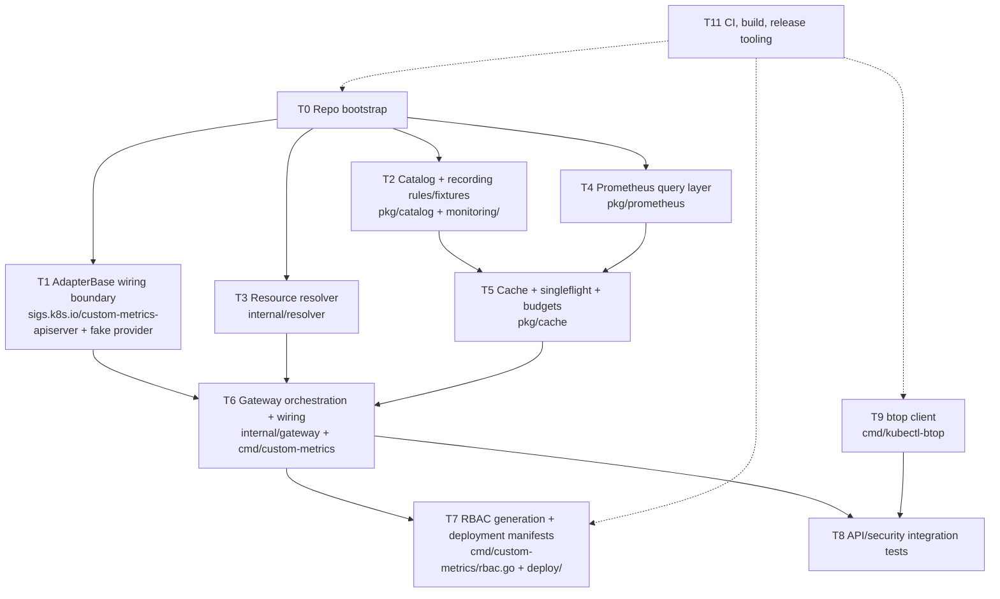

# Implementation Plan

Status: proposed task breakdown derived from [`metric-gateway.md`](metric-gateway.md) (the spec) and
[`design.md`](design.md) (the repository/package layout). Each task below is scoped to be assignable
independently — to a person, a session, or an agent — with explicit inputs, outputs, and boundaries so
work can proceed in parallel where the dependency graph allows it.

Every task lists the design.md section(s) it implements and the metric-gateway.md section(s) that define
its behavior. No task should require re-deriving decisions already locked in those two documents.

---

## 0. Task dependency graph

Independent starting points: **T1, T2, T3, T4** need T0 (T1 lives under `cmd/custom-metrics` and pins
`sigs.k8s.io/custom-metrics-apiserver`; T2–T4 live under the shared `internal/` tree; all four depend on
the pinned `controller-gen`/Prometheus tooling and Makefile targets T0 sets up). **T9 needs
none of that.** `cmd/kubectl-btop` only talks to the Kubernetes API — `k8s.io/client-go` for
kubeconfig/REST config and `k8s.io/metrics/pkg/client/custom_metrics` for the metrics calls themselves —
plus `cobra`/`pflag` for its own command tree. It has zero dependency on `internal/gateway`,
`pkg/prometheus`, `pkg/catalog`, `pkg/cache`, `sigs.k8s.io/custom-metrics-apiserver`, or on any of T0's
gateway-specific setup (controller-gen pinning, Prometheus test tooling). It can be developed, unit
tested, and merged as its own self-contained module-internal path in full isolation, even before T0's
gateway-oriented scaffolding exists — the only shared artifact is the repository's `go.mod`, which a `T9`
implementer can create directly if it doesn't exist yet. T5 needs T4's `Querier` shape stabilized enough
to design cache keys, but can start on the LRU/singleflight mechanics immediately. T6 is the integration
point and is the critical path: it cannot finish until T1, T2, T3, T4, T5 all land. T7/T8 depend on T6;
T8's btop-specific assertions additionally depend on T9.

This split matches design.md §17's suggested order but decomposes it into units with clear ownership
boundaries and explicit "done" criteria, so multiple tasks can run concurrently instead of strictly
sequentially.

---

## T0 — Repository bootstrap

**Goal:** a compiling, empty-but-structured repo that every other task builds on.

**Scope:**
- `go.mod` at Go 1.26 with the repository module path (design.md §14).
- Both `main.go` entry points with the `run(ctx, args, stdin, stdout, stderr) int` shape (design.md §4);
  no logic yet beyond exit-code plumbing and signal handling (`SIGINT`, plus `SIGTERM` for
  `cmd/custom-metrics`).
- Empty package directories per the tree in design.md §2 created only as needed (design.md: "Add
  directories only when their implementation begins").
- `Makefile` targets: `build`, `test`, `vet` (design.md §16). Other targets (`generate`, `manifests`,
  `test-rules`) are stubbed by later tasks (T7, T2).
- Pin `controller-gen` and any Prometheus test tooling as Go tool dependencies (design.md §17 step 1).

**Out of scope:** any business logic, flags beyond `--kubeconfig`/basic scaffolding, RBAC markers.

**Depends on:** nothing.

**Blocks:** all other tasks.

**Done when:** `make build` produces two empty binaries that exit 0, `make vet` and `make test` pass on
an empty tree, and `go.mod` pins the versions listed in design.md §14.

---

## T1 — AdapterBase wiring boundary

**Goal:** prove `cmd/custom-metrics`'s wiring of `sigs.k8s.io/custom-metrics-apiserver`'s `basecmd.AdapterBase`
end-to-end with a fake provider, before any gateway-specific logic exists — the framework, not this
repository, owns the reusable server implementation (design.md §2.1).

**Packages:** `cmd/custom-metrics/{main,command,flags,version,health}.go`, using a temporary fake
`provider.CustomMetricsProvider` in this task's own tests (`internal/gateway`'s real provider lands in T6).

**Reads:** design.md §3 (dependency direction), §10 (API server integration); metric-gateway.md §3.5, §3.6
(wire/path/error contract), §5 (delegated authentication/authorization model).

**Scope:**
- Construct `basecmd.AdapterBase` inside a `*cobra.Command`: `adapter.FlagSet = cmd.Flags()`,
  `adapter.InstallFlags()`, then register this repository's own gateway flags (§ T6) on the same
  `cmd.Flags()`.
- `adapter.WithCustomMetrics(fakeProvider)` for this task's tests; `adapter.Config()` to inject a
  placeholder readyz check (real checks land in T6); `adapter.Run(ctx)` to serve.
- Verify discovery lists the fake provider's `provider.CustomMetricInfo` entries, named/wildcard list
  wrapping (`MetricValueList`, single item for named requests) and malformed-selector `400`s come from the
  framework's own REST storage — this repository does not reimplement that layer.
- Verify delegated authentication/authorization: a caller with `custom.metrics.k8s.io` RBAC on the fake
  provider's resource succeeds; a caller without it gets `403` from the SubjectAccessReview
  `DelegatingAuthorizationOptions` issues, before the fake provider is ever called; an unauthenticated or
  spoofed-identity request gets `401`. `/healthz`, `/readyz`, `/livez` stay anonymous and
  Prometheus-independent (there is no Prometheus yet in this task).
- No gateway-specific dependency test is needed here: `internal/gateway`, `pkg/prometheus`,
  `internal/resolver`, `pkg/catalog`, and `pkg/cache` do not exist as import targets for
  `cmd/custom-metrics` yet at this point in the sequence.

**Out of scope:** anything Prometheus-, catalog-, or workload-resolution-related; the real
`internal/gateway` provider (T6).

**Depends on:** T0.

**Blocks:** T6 (gateway wiring drops its real provider into this already-proven `AdapterBase` setup).

**Done when:** a fake provider can be registered via `WithCustomMetrics`, discovery lists its
`CustomMetricInfo` entries, a client using `k8s.io/metrics/pkg/client/custom_metrics` gets correct
named/wildcard responses, an authenticated caller without the right `custom.metrics.k8s.io` RBAC is
rejected `403` by delegated authorization while one with it succeeds, and unauthenticated/untrusted
requests are rejected `401`.

---

## T2 — Catalog and normalized recording rules

**Goal:** an immutable, validated metric catalog plus the Prometheus recording-rule contract the gateway
assumes, proven numerically correct before any gateway code consumes it.

**Packages:** `pkg/catalog/*`, `monitoring/*`.

**Reads:** design.md §9, §8 (numeric fixture requirements); metric-gateway.md §2 (grammar), §6.3
(catalog YAML), §8 "Normalized Prometheus input contract" and "Catalog ConfigMap".

**Scope:**
- YAML decoding with unknown-field rejection, base-name/series/unit/scope/aggregation validation, catalog
  revision tracking.
- Metric-name parsing by known base-prefix match, not naive underscore splitting (bases contain
  underscores, e.g. `node_cpu`).
- Discovery-entry expansion capped at 784 entries (metric-gateway.md §2); reject configs that would
  exceed `--discovery-max-metrics`.
- `monitoring/rules.yaml`: recording rules producing `pod_cpu_usage_cores`, `pod_memory_working_set_bytes`,
  `node_cpu_usage_cores`, `node_memory_used_bytes`, and the `*_active`/`*_complete` lifecycle/completeness
  series, per metric-gateway.md §8.
- `monitoring/rules_test.yaml`: `promtool` fixtures distinguishing sum-then-stat vs stat-then-sum, fleet
  p95 vs summed-pod p95, CPU mode exclusions (`idle`, `iowait`, `guest*` excluded), node memory
  (`MemTotal - MemAvailable`), duplicate-scrape-source dedup, and missing-container detection.
- `make test-rules` wired to run these fixtures.

**Out of scope:** anything that queries a live Prometheus server (that's T4); anything that resolves
Kubernetes objects (T3).

**Depends on:** T0.

**Blocks:** T5 indirectly (cache key includes `catalogRevision`); more directly blocks T6, since gateway
orchestration needs a validated catalog to parse requests.

**Done when:** invalid catalogs (unknown fields, unknown bases, arbitrary PromQL, empty catalog) are
rejected before serving starts; `promtool` fixtures pass and numerically distinguish the cases listed
above; metric-name parsing round-trips all 224 grammar combinations plus rejects malformed ones.

---

## T3 — Resource resolver

**Goal:** translate a target (Pod/Node/Deployment/StatefulSet/DaemonSet/Job/CronJob, named or wildcard)
into resolved object identities and deduplicated retained Pod/Node UIDs, using the gateway ServiceAccount.

**Packages:** `internal/resolver/*`.

**Reads:** design.md §7; metric-gateway.md §3.3 (resolution table), §3.4 (CronJob fallback).

**Scope:**
- Pod/Node resolution by GET/list, retaining UID and creation time.
- Deployment/StatefulSet/DaemonSet/Job resolution via full `metav1.LabelSelector` (including
  `matchExpressions`) converted with `metav1.LabelSelectorAsSelector`.
- CronJob fallback: active Jobs (`status.active > 0`, owner UID match) → else Jobs within the configured
  fallback window (default 24h, by `status.completionTime` or `status.startTime`) → else the specific
  `NotFound` shape from metric-gateway.md §3.4.
- Union-by-UID deduplication across selector results.
- Wildcard listing with the ServiceAccount identity, bounded/paginated.
- Map permission failures on the ServiceAccount to `503`, never caller `403`.

**Out of scope:** PromQL construction (T4), caching (T5), HTTP-level error translation beyond returning
typed Go errors the gateway can map.

**Depends on:** T0.

**Blocks:** T6.

**Done when:** unit tests cover Pod/Node direct lookup, each workload's `matchExpressions` selector, UID
union across overlapping selectors, CronJob active-vs-recent-vs-404 branching (using an injected clock,
never real sleeps), and Job/Pod deletion-and-recreation with different UIDs producing correct retained
membership — all against a fake Kubernetes client.

---

## T4 — Prometheus query layer

**Goal:** render structured queries to PromQL and safely execute/decode them against Prometheus, with no
knowledge of catalogs, caching, or Kubernetes objects.

**Packages:** `pkg/prometheus/*`.

**Reads:** design.md §8; metric-gateway.md §3.2 (aggregation strategies, temporal definitions), §3.7
(coverage/freshness), §6.1 (Prometheus-related flags), §6.3 (per-query/response size limits).

**Scope:**
- `Querier` interface with a narrow surface; HTTP details (TLS verification, connection pool, token-file
  auth, redirect/userinfo rejection) stay private to this package.
- PromQL rendering for sum-then-stat and stat-then-sum, per statistic (`avg`, `max`, `min`, `p50/90/95/99`
  via `quantile_over_time`, `stddev`), on the fixed 60-second grid.
- Coverage/completeness/freshness validation: union-active grid, explicit zero-fill for confirmed-inactive
  members in stat-then-sum, 30-second source-freshness gate, rejection of gaps rather than silent
  reduction.
- Response validation: protocol errors, warnings/partial data, unexpected result types (require vector for
  identity-bearing queries), duplicate identities, NaN/Inf, negative values.
- Enforce query length, decompressed body size, and per-query timeout from metric-gateway.md §6.3.

**Out of scope:** cache key formation (T5), resolving Kubernetes objects into UIDs (T3) — this package
receives escaped UIDs, not label selectors.

**Depends on:** T0. (Can build against a real or `httptest.Server`-mocked Prometheus without waiting on
T2's actual rule fixtures, though its golden-query tests should target the series names T2 defines.)

**Blocks:** T5 (cache wraps `Querier` results), T6.

**Done when:** golden-query tests cover every combination listed in design.md §8 (metric kind × scope ×
aggregation order × statistic × single/wildcard/CronJob-union target × empty/missing/duplicate/overlap/
stale/incomplete edge cases), and numeric fixtures against a real Prometheus instance validate at least
one aggregation-order distinction end-to-end.

---

## T5 — Cache, singleflight, and admission budgets

**Goal:** a process-local response cache and duplicate-request collapsing layer that the gateway can wrap
around any `Querier`/`Resolver` pair.

**Packages:** `pkg/cache/*`.

**Reads:** design.md §6 (request path steps 2–4, 8), §14 (LRU dependency choice); metric-gateway.md §4
(cache design), §6.3 (inflight/computation budgets).

**Scope:**
- Canonical key: `(catalogRevision, verb, namespace, groupResource, objectName, metricName,
  objectSelectorHash, metricSelectorHash)` — no caller identity.
- Size-bounded TTL LRU: entry cap (`--cache-size`, default 10000) and accounted byte cap
  (`--cache-max-bytes`, default 64 MiB); entries over 1 MiB returned but not cached.
- Window-driven TTL: `≤1h → 15s`, `>1h → 10m`.
- `golang.org/x/sync/singleflight`-based collapsing, kept as a separate concern from the LRU (design.md
  §6: "Keep singleflight outside the LRU implementation").
- Shared-flight context bounded by server shutdown and `--request-timeout`, not the first caller's
  context; independent waiter cancellation.
- Admission limits: `--max-inflight-requests` (default 128) and `--max-shared-computations` (default 32),
  each rejecting excess with `429`/`Retry-After: 1`.
- Cache only successful complete results (including valid empty wildcard lists); never cache errors.

**Out of scope:** what gets cached (that's the gateway's `Result`/`Key` types built in T6) — this task can
develop and test against synthetic `Result` stand-ins.

**Depends on:** T0. Benefits from T4's `Querier` shape existing but does not require it.

**Blocks:** T6.

**Done when:** race tests pass for concurrent get/set and singleflight collapse; TTL expiry uses an
injected clock (no sleeps); byte/entry eviction is verified under load; a caller disconnecting mid-flight
does not cancel other waiters; admission limits return the correct status/backoff.

---

## T6 — Gateway orchestration and wiring (critical path)

**Goal:** the actual use-case flow that ties catalog, resolver, Prometheus, and cache together behind the
`sigs.k8s.io/custom-metrics-apiserver/pkg/provider.CustomMetricsProvider` contract, dropped into T1's
already-proven `AdapterBase` wiring in place of its fake provider.

**Packages:** `internal/gateway/*`, `internal/telemetry/*`, `internal/config/*`, `cmd/custom-metrics/*`
(minus `rbac.go`, which is T7).

**Reads:** design.md §6 (full request path), §7 (resource resolution via `AdapterBase`'s dynamic
client/RESTMapper), §10 (API server integration/readiness), §5 (flags/env precedence); metric-gateway.md
§5 (delegated authentication/authorization model), §6.1 (all gateway flags), §3.7, §9 (full request flow
diagrams).

**Scope:**
- `internal/gateway/service.go`: implements the 10-step request path from design.md §6 exactly — parse →
  cache lookup → singleflight → resolve → capture eval time → query → validate coverage → build result →
  convert → cache store → record telemetry. Step 1 assumes delegated authentication/authorization already
  ran in `AdapterBase`'s filter chain (T1) before this code executes at all — this task does not implement
  or re-check authorization.
- `internal/gateway/provider.go`: implements `provider.CustomMetricsProvider`'s three methods directly,
  converting internal results to `MetricValue`/`MetricValueList` using `k8s.io/metrics/pkg/apis/custom_metrics/v1beta2`
  types and `provider` package error constructors (`NewMetricNotFoundError` and its variants) for 404s.
- `cmd/custom-metrics`: replaces T1's fake provider with this real one via `adapter.WithCustomMetrics(...)`;
  flags/env with the precedence rules in design.md §5.2 for the gateway-specific `Options` registered
  alongside `AdapterBase`'s own flags; `Complete`/`Validate`/`Run` lifecycle; readiness checks (catalog
  loaded, ServiceAccount reads work, bounded Prometheus check) injected via `adapter.Config()` without
  making liveness/discovery depend on Prometheus; SIGTERM drain within the grace period (generic-apiserver's
  own graceful shutdown, triggered by canceling the context passed to `adapter.Run(ctx)`).
- Telemetry: the metrics listed in metric-gateway.md §4 ("Cache Metrics"), registered into the same
  registry `AdapterBase`'s `/metrics` endpoint serves, with bounded cardinality (no namespace/name/
  selector/user labels).
- Error mapping: exact status codes from metric-gateway.md §3.6 (400/404/413/429/503/504 — 401/403 are
  handled upstream of this code, by T1's `AdapterBase` wiring) applied consistently across every failure
  path this task's code owns.

**Out of scope:** RBAC marker generation and deployment YAML (T7); btop (T9); delegated
authentication/authorization mechanics (T1/upstream).

**Depends on:** T1, T2, T3, T4, T5 all reaching a stable interface (not necessarily 100% feature-complete,
but their public interfaces/types should be settled before this task starts integrating against them).

**Blocks:** T7, T8.

**Done when:** the request-flow diagrams in metric-gateway.md §9 and §10 work against a real kind cluster
plus mocked/real Prometheus, for both cache-hit and cache-miss paths, with correct status codes for every
error class in §3.6.

---

## T7 — RBAC generation and deployment manifests

**Goal:** generated least-privilege RBAC plus the maintained deployment manifests around it.

**Packages/paths:** `cmd/custom-metrics/rbac.go`, `deploy/base/role.yaml` (generated), `deploy/examples/`.

**Reads:** design.md §13; metric-gateway.md §5 ("RBAC:" paragraph), §8 (Deployment Topology table).

**Scope:**
- `+kubebuilder:rbac` markers scoped to exactly get/list on Pods, Nodes, and the six supported workload
  kinds — no wildcards, no impersonation. This generated `ClusterRole` covers backend resolution only, not
  the delegated-authentication/authorization plumbing below.
- `go tool controller-gen` wiring in `make generate`, with a committed generated-file header on
  `deploy/base/role.yaml`.
- Maintained (non-generated) manifests: ServiceAccount; a `ClusterRoleBinding` of the gateway ServiceAccount
  to the built-in `system:auth-delegator` `ClusterRole` (grants the `TokenReview`/`SubjectAccessReview`
  calls `DelegatingAuthenticationOptions`/`DelegatingAuthorizationOptions` make); the
  `extension-apiserver-authentication-reader` RoleBinding; `APIService`; NetworkPolicy;
  PodDisruptionBudget; an example HPA/user `ClusterRole` + `ClusterRoleBinding` granting `get`/`list`/`watch`
  on specific `custom.metrics.k8s.io` resource/subresources — this is the RBAC delegated authorization
  actually checks per request (metric-gateway.md §5), not a documentation-only convention; optional
  cert-manager `Certificate` and `ServiceMonitor` examples (the `ServiceMonitor` needs a bearer token
  authorized through the same delegated chain, not a dedicated monitoring CA).
- `make manifests` validation: serving-CA injection/rotation sanity, presence of the `system:auth-delegator`
  and authentication-reader bindings, collision detection against an existing `APIService` for the same
  group/version.

**Depends on:** T6 (needs the final binary/flag surface to document correctly), though the controller-gen
tool pinning and marker syntax can be prototyped as soon as T0 lands.

**Blocks:** nothing downstream except release packaging (T11) and full end-to-end tests (T8).

**Done when:** `make generate` reproduces `deploy/base/role.yaml` byte-for-byte from markers, `make
manifests` fails on a deliberately broken trust config, a missing `system:auth-delegator` binding, or an
`APIService` collision, and the example HPA binding grants metric reads (verified via SAR) without
underlying workload reads.

---

## T8 — API and security integration tests

**Goal:** the release-gating proof that authorization, isolation, and correctness hold together as a
system, not just per-package.

**Reads:** design.md §15 (levels 3–5); metric-gateway.md §12 ("Security integration tests").

**Scope:**
- Temporary serving/request-header certificate fixtures; discovery, named/wildcard envelopes, spoofed
  direct-access rejection, CA/CN rotation, `/metrics` route authorization, stalled-request cancellation.
- Kind-cluster end-to-end: a user authorized only for `custom.metrics.k8s.io` reads (no underlying Pod/
  Node/workload read access) succeeds on cold cache, hot cache, and shared-singleflight paths; a user
  without that `custom.metrics.k8s.io` RBAC reaches the gateway process but is rejected `403` by its
  delegated `SubjectAccessReview` before `internal/gateway`'s provider is ever invoked.
- HPA and `btop` verified against v1beta2 discovery with normalized fixtures.

**Depends on:** T6 (needs a real running gateway), T7 (needs real RBAC/APIService manifests), and T9
for the btop-specific assertions — this is the one point where the otherwise-independent T9 stream
reconnects with the gateway stream.

**Blocks:** release sign-off only; does not block other implementation tasks.

---

## T9 — `kubectl-btop` client

**Goal:** the fetch → join → output path for a single request cycle. `btop` is a one-shot snapshot tool;
there is no watch/refresh mode.

**Packages:** `cmd/kubectl-btop/{main,command,resources,flags,version,client,collector,output}.go`.

**Reads:** design.md §4, §5.3, §12; metric-gateway.md §6.2 (flags/env), §7.1–§7.3 (command surface, table
and flattened JSON/YAML output), §7.4 (distribution — not built here, just kept in mind for flag/version
plumbing).

**Scope:**
- Cobra `*cobra.Command` tree per design.md §5.3: a root `btop` command carrying the shared flags as
  `PersistentFlags()`, plus a table-driven `newResourceCommand` factory in `resources.go` producing the
  seven resource subcommands with their descriptor-driven `Aliases` (`po`/`deploy`/`sts`/`ds`/`job`/`cj`),
  `Args: cobra.MaximumNArgs(1)`, and shared `PreRunE` validation (namespace rejected on the cluster-scoped
  Nodes descriptor, selector rejected together with a positional object name).
- `client.go`: `custom_metrics.NewForConfig` usage, private transport wrapper binding `rest.Config.Timeout`
  and invocation context together, cleanup of cancellation callbacks per round trip.
- `collector.go`: fetch CPU/memory rows independently (no atomic snapshot exists), reject mismatched
  sets/incarnations, retain evaluation timestamps for age/skew reporting.
- `output.go`: table/flattened-JSON/YAML rendering, numeric sort by CPU/memory descending with
  namespace/name tie-break, `name` sort ascending, stderr-only diagnostics, exit codes `0`/`1`/`2` per
  metric-gateway.md §7.3.
- Env/flag precedence per design.md §5.2, applied to every environment variable in metric-gateway.md §6.2 (`--stat`, `--selector`, and `--no-headers` are flag-only).

**Out of scope:** any watch/refresh mode, TTY/alternate-screen logic.

**Depends on:** nothing but the Kubernetes API surface itself. `cmd/kubectl-btop` imports only
`k8s.io/client-go`, `k8s.io/metrics/pkg/client/custom_metrics`, `github.com/spf13/cobra`, and
`github.com/spf13/pflag` — none of `internal/gateway`, `pkg/prometheus`, `pkg/catalog`,
`pkg/cache`, or `sigs.k8s.io/custom-metrics-apiserver`, and none of T0's gateway-specific setup (controller-gen
pinning, Prometheus test tooling). It can be developed and unit-tested entirely against a fake/mock
`custom_metrics` client, fully in parallel with — and without waiting on — T0's gateway scaffolding or
any of T1–T6. The only shared artifact is the repository's `go.mod`; if T0 hasn't landed yet, this task
can create it.

**Blocks:** nothing downstream except T8's btop assertions and T11's release packaging.

**Done when:** commands for all seven resource kinds produce correct table/JSON/YAML output
against a fake server, reject invalid flag combinations (namespace-on-nodes, selector+named-object,
`--containers`), and cancellation of a stalled HTTP call is proven with a test server.

---

## T11 — Build, CI, and release tooling

**Goal:** the mechanical scaffolding that keeps every other task honest and ships the final artifacts.

**Reads:** design.md §16; metric-gateway.md §7.4.

**Scope:**
- `Makefile` targets beyond T0's stub: `generate`, `manifests`, `test-rules` wired to their owning tasks.
- CI: `go vet`, `go test -race ./...`, Kubernetes-module-minor alignment check (including
  `sigs.k8s.io/custom-metrics-apiserver`'s pinned version, design.md §14), `go mod tidy` check, `promtool`
  fixture run (T2).
- Cross-compilation of `kubectl-btop` only, to the five raw artifact names in metric-gateway.md §7.4, plus
  SHA256 checksums and cosign signing.
- Container image build for `custom-metrics`: non-root user, read-only root filesystem, no shell.

**Depends on:** loosely on all other tasks reaching a testable state; can be scaffolded early (T0) and
filled in incrementally as each task lands its own `make` target.

**Blocks:** nothing functionally, but is the release gate.

---

## Suggested parallel work streams

If splitting across multiple contributors/agents immediately after T0:

- **Stream A (server core):** T1 → contributes to T6.
- **Stream B (data/catalog):** T2 → contributes to T6.
- **Stream C (Kubernetes):** T3 → contributes to T6.
- **Stream D (Prometheus):** T4 → T5 → contributes to T6.
- **Stream E (client):** T9, entirely independent of T0 and streams A–D — it only needs the
  Kubernetes API surface (`client-go`, `custom_metrics` client) and can start on day one, in parallel
  with T0 itself, without waiting for any gateway-side package or tooling.

One owner should hold T6 itself, since it is the integration point where A–D's interfaces must actually
compose correctly — treat it as a merge/integration task, not a from-scratch build. T7 and T11 follow once
T6 stabilizes; T8 additionally waits on stream E (T9) for its btop-specific assertions.
